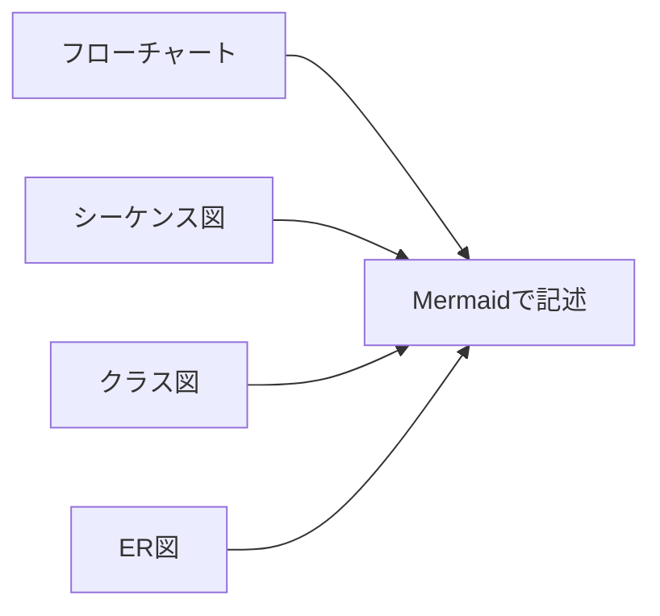
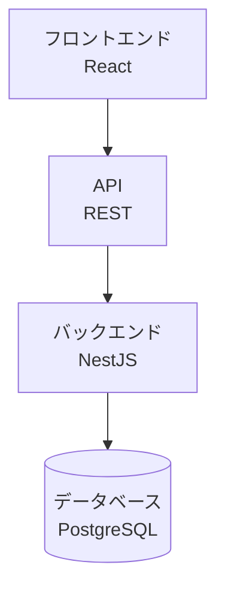
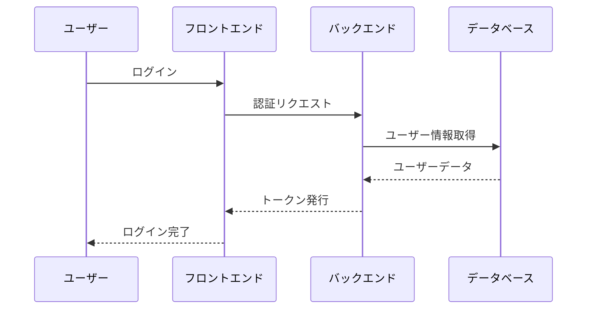

# エージェント指示書

このドキュメントは、AIエージェントがこのリポジトリで作業する際に従うべき指示を定義します。

## 文章スタイル

### 箇条書きの使用
- 情報は箇条書きで整理する
- 各項目は簡潔に記述する
- ネストは必要最小限にとどめる

### 文章の長さ制限
- 1つの文章は最大3文以内とする
- 3文を超える場合は段落やブロックを分ける
- 長い説明が必要な場合は小見出しを使用する

### 例：適切な文章構造
```markdown
## 機能概要
本システムは勤怠管理を行います。ユーザーは出退勤を記録できます。履歴の閲覧も可能です。

## 主な機能
- 出勤・退勤の打刻
- 勤怠履歴の閲覧
- 月次レポートの生成
```

## 図表の記述

### Mermaidの使用
- ドキュメント内の図はMermaidで記述する
- 画像ファイルではなくテキストベースの図を優先する
- 複雑な図は適切に分割する

### 対応する図の種類


### 使用例

Mermaidを使用したシステム構成図の例：



マークダウンでは以下のように記述します：

    ```mermaid
    graph TD
        A[フロントエンド<br/>React] --> B[API<br/>REST]
        B --> C[バックエンド<br/>NestJS]
        C --> D[(データベース<br/>PostgreSQL)]
    ```

## コミュニケーション

### 使用言語
- すべてのやり取りは日本語で行う
- コミットメッセージは日本語で記述する
- ドキュメントは日本語で作成する
- コードコメントは日本語で記述する（必要最小限）

### 文体
- ドキュメント: です・ます調
- コードコメント: 簡潔な体言止めまたはです・ます調
- コミットメッセージ: 簡潔な記述

## コード記述

### コメントの原則
- 過剰なコメントは避ける
- コードで意図が明確な場合はコメント不要
- 複雑なロジックにのみコメントを追加する

### コメントが必要な場合
- アルゴリズムの説明が必要な複雑な処理
- 外部APIやライブラリの特殊な使い方
- ビジネスロジックの背景や理由

### コメントが不要な場合
- 変数名や関数名で意図が明確な場合
- 標準的なパターンやイディオム
- 自明な処理や簡単な計算

### 例：適切なコメント

```typescript
// ❌ 過剰なコメント
// ユーザーIDを取得する
const userId = user.id;

// ユーザー名を取得する
const userName = user.name;

// ❌ 不要なコメント
function add(a: number, b: number): number {
  // aとbを足し算する
  return a + b;
}

// ✅ 適切なコメント
// JWT トークンの有効期限は24時間
// セキュリティポリシーに基づき変更禁止
const TOKEN_EXPIRY = 24 * 60 * 60 * 1000;

// ✅ 複雑なロジックの説明
function calculateWorkingHours(clockIn: Date, clockOut: Date): number {
  // 休憩時間（12:00-13:00）を勤務時間から除外
  // 深夜勤務（22:00-5:00）は割増計算
  const baseHours = (clockOut.getTime() - clockIn.getTime()) / (1000 * 60 * 60);
  // ... 複雑な計算
}
```

## ドキュメント作成

### 構造
- 見出しは階層的に整理する
- 目次は必要に応じて追加する
- 関連ドキュメントへのリンクを含める

### 箇条書きの活用
```markdown
## 機能一覧
- ユーザー認証
  - ログイン
  - ログアウト
  - パスワードリセット
- 勤怠管理
  - 出勤打刻
  - 退勤打刻
  - 履歴閲覧
```

### 図の配置

シーケンス図の例：



マークダウンでは以下のように記述します：

    ```mermaid
    sequenceDiagram
        participant U as ユーザー
        participant F as フロントエンド
        participant B as バックエンド
        participant D as データベース
        
        U->>F: ログイン
        F->>B: 認証リクエスト
        B->>D: ユーザー情報取得
        D-->>B: ユーザーデータ
        B-->>F: トークン発行
        F-->>U: ログイン完了
    ```

## コミット規約

### メッセージフォーマット
```
[種類] 簡潔なタイトル

詳細な説明（必要な場合）
```

### 種類
- `[追加]`: 新機能やドキュメントの追加
- `[修正]`: バグ修正
- `[更新]`: 既存機能やドキュメントの更新
- `[削除]`: 不要なコードやドキュメントの削除
- `[リファクタ]`: リファクタリング

### 例
```
[追加] エージェント指示書を作成

AIエージェント向けの作業ガイドラインを追加しました。
文章スタイル、図表の記述方法、コード記述の原則を定義しています。
```

## レビュー観点

### ドキュメントレビュー
- 文章は3文以内に収まっているか
- 箇条書きが適切に使われているか
- 図はMermaidで記述されているか
- 日本語で記述されているか

### コードレビュー
- 過剰なコメントがないか
- 必要なコメントは適切に配置されているか
- コードの可読性は十分か
- 命名は明確で理解しやすいか
