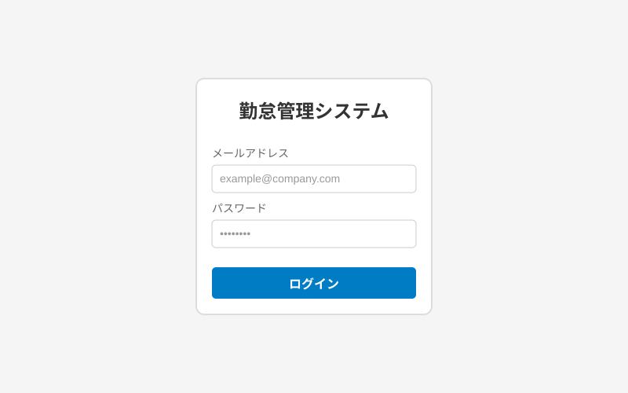
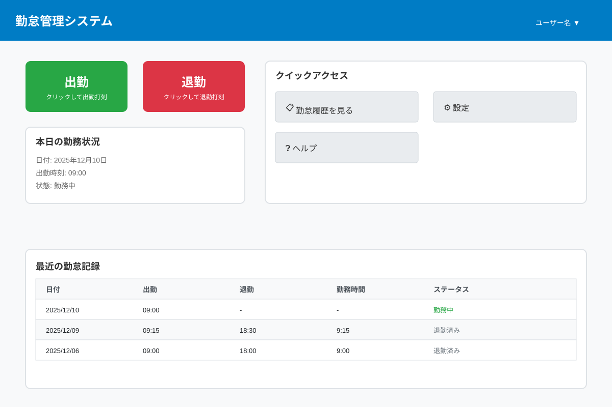
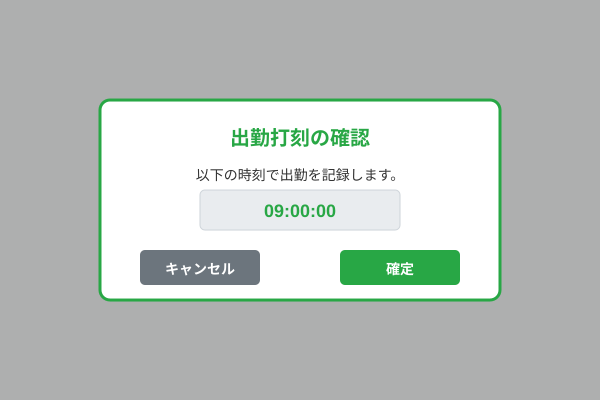
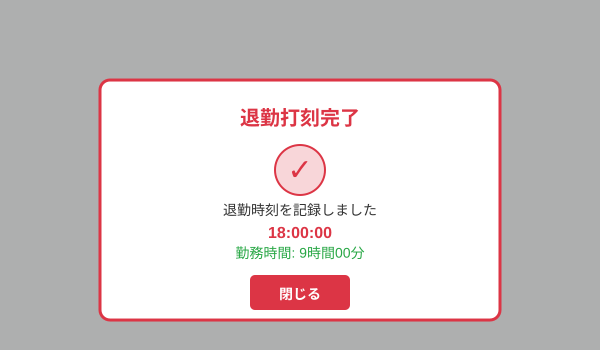
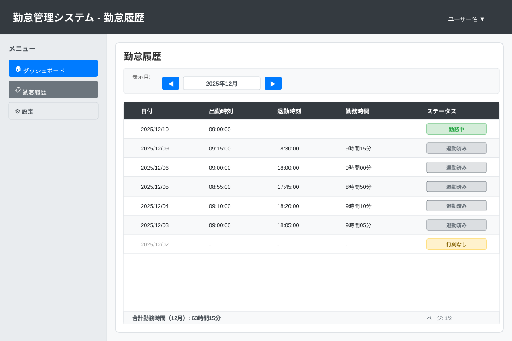

# 勤怠管理システム - ユーザーマニュアル

## 目次

1. [はじめに](#はじめに)
2. [ログイン方法](#ログイン方法)
3. [出勤・退勤打刻](#出勤退勤打刻)
4. [勤怠履歴の確認](#勤怠履歴の確認)
5. [ログアウト方法](#ログアウト方法)
6. [よくある質問](#よくある質問)
7. [トラブルシューティング](#トラブルシューティング)

---

## はじめに

勤怠管理システムへようこそ。本システムは、従業員の出勤・退勤時刻を記録し、勤怠履歴を管理するためのWebアプリケーションです。

### システムの主な機能

- ✅ ユーザー認証によるセキュアなアクセス
- ✅ 簡単な出勤・退勤打刻
- ✅ 個人の勤怠履歴閲覧
- ✅ 勤務時間の自動計算

### 必要な環境

- インターネット接続
- 対応Webブラウザ（Chrome, Firefox, Edge, Safari の最新版）
- ログイン用のユーザー名とパスワード（管理者から発行）

---

## ログイン方法

### 手順

1. ブラウザでシステムのURLにアクセスします
2. ログイン画面が表示されます

3. **ユーザー名**を入力します
4. **パスワード**を入力します
5. **ログイン**ボタンをクリックします

### 注意事項

- ユーザー名とパスワードは管理者から事前に発行されます
- パスワードは大文字・小文字を区別します
- 複数回ログインに失敗すると、アカウントが一時的にロックされる場合があります

---

## 出勤・退勤打刻

ログインに成功すると、メインダッシュボードが表示されます。

### 出勤打刻

1. ダッシュボード上部の**「出勤」**ボタンをクリックします
2. 確認メッセージが表示されます
3. **「確定」**をクリックすると、現在時刻で出勤が記録されます
4. 打刻完了のメッセージが表示されます

### 退勤打刻

1. ダッシュボード上部の**「退勤」**ボタンをクリックします
2. 確認メッセージが表示されます
3. **「確定」**をクリックすると、現在時刻で退勤が記録されます
4. 打刻完了のメッセージが表示され、勤務時間が表示されます

### 重要な注意点

⚠️ **出勤打刻は1日1回のみ可能です**
- すでに出勤打刻済みの場合、「出勤」ボタンは無効化されます

⚠️ **退勤打刻は出勤後のみ可能です**
- 出勤打刻をしていない場合、「退勤」ボタンは無効化されます

⚠️ **打刻の修正はできません**
- 誤って打刻した場合は、管理者に連絡してください

---

## 勤怠履歴の確認

### 履歴の表示方法

1. 左側のメニューから**「勤怠履歴」**をクリックします
2. 自分の勤怠記録一覧が表示されます

### 表示される情報

勤怠履歴には以下の情報が表示されます:

| 項目 | 説明 |
|------|------|
| 日付 | 勤務日 |
| 出勤時刻 | 出勤を打刻した時刻 |
| 退勤時刻 | 退勤を打刻した時刻 |
| 勤務時間 | 自動計算された勤務時間（時間：分） |
| ステータス | 勤務状況（勤務中、退勤済み など） |

### 期間指定での表示

1. 画面上部の**「開始日」**と**「終了日」**を指定します
2. **「検索」**ボタンをクリックします
3. 指定期間の勤怠記録が表示されます

### ソート機能

- 各列のヘッダーをクリックすると、その列で並び替えができます
- 日付は降順（新しい順）がデフォルトです

---

## ログアウト方法

### 手順

1. 画面右上のユーザー名をクリックします
2. ドロップダウンメニューが表示されます
3. **「ログアウト」**を選択します
4. ログイン画面に戻ります

### セキュリティのための推奨事項

- 作業が終わったら必ずログアウトしてください
- 共有PCを使用している場合は特に重要です
- 一定時間操作がない場合、自動的にログアウトされます（30分）

---

## よくある質問

### Q1: パスワードを忘れてしまいました

**A:** 管理者に連絡してパスワードのリセットを依頼してください。セキュリティ上の理由から、システム上でパスワードの自動リセットはできません。

### Q2: 打刻を間違えてしまいました

**A:** 打刻の修正はユーザー自身では行えません。管理者に連絡して修正を依頼してください。その際、正しい時刻を伝えてください。

### Q3: 出勤打刻を忘れてしまいました

**A:** できるだけ早く打刻してください。実際の出勤時刻と異なる場合は、管理者に連絡して修正を依頼してください。

### Q4: 勤怠履歴が表示されません

**A:** 以下を確認してください:
- ログインは正常にできていますか？
- 過去に打刻記録がありますか？
- 期間指定が正しいですか？

問題が解決しない場合は、管理者に連絡してください。

### Q5: 外出先から打刻できますか？

**A:** インターネット接続があれば、どこからでもアクセス可能です。ただし、会社のポリシーに従ってください。

### Q6: スマートフォンから使用できますか？

**A:** Webブラウザから利用可能ですが、現バージョンではPCでの使用を推奨しています。

---

## トラブルシューティング

### ログインできない

**症状**: ユーザー名とパスワードを入力してもログインできない

**対処法**:
1. ユーザー名とパスワードに誤りがないか確認
2. パスワードの大文字・小文字が正しいか確認
3. Caps Lockがオンになっていないか確認
4. 複数回失敗している場合は、10分待ってから再試行
5. それでも解決しない場合は管理者に連絡

### 打刻ボタンが押せない

**症状**: 出勤または退勤ボタンがグレーアウトしている

**対処法**:
1. すでに本日の打刻を完了していないか確認
2. 出勤打刻せずに退勤しようとしていないか確認
3. ページを再読み込みしてみる
4. 問題が続く場合は管理者に連絡

### 画面が正しく表示されない

**症状**: レイアウトが崩れている、ボタンが表示されない

**対処法**:
1. ブラウザを最新版に更新
2. キャッシュをクリア（Ctrl + F5 または Cmd + Shift + R）
3. 別のブラウザで試してみる
4. JavaScriptが有効になっているか確認

### 勤務時間が正しく計算されない

**症状**: 表示されている勤務時間が実際と異なる

**対処法**:
1. 出勤・退勤時刻が正しく記録されているか確認
2. 時刻はシステム時刻に基づいているため、端末の時刻設定を確認
3. 管理者に連絡して確認を依頼

---

## サポート

問題が解決しない場合や、本マニュアルに記載されていない内容については、システム管理者にお問い合わせください。

**管理者連絡先**: [社内連絡先を記載]

---

**最終更新日**: 2025年12月
**バージョン**: 1.0.0
