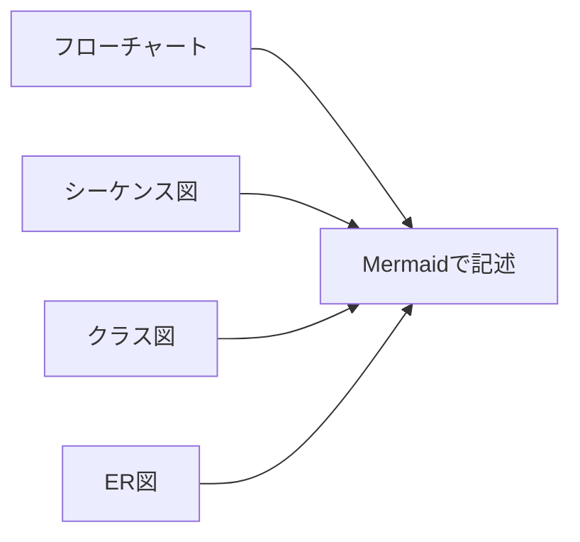
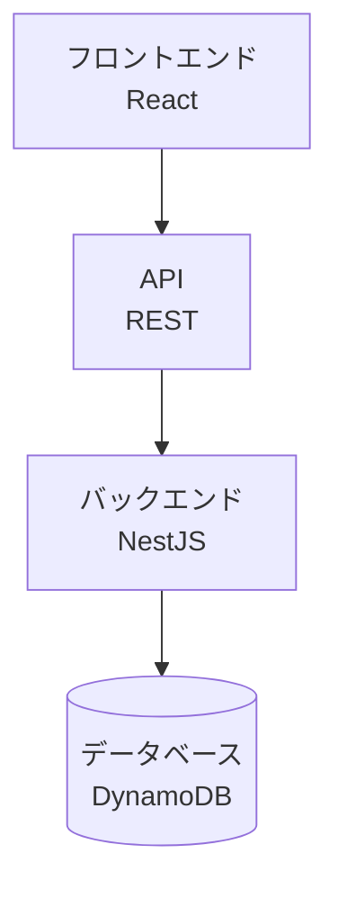
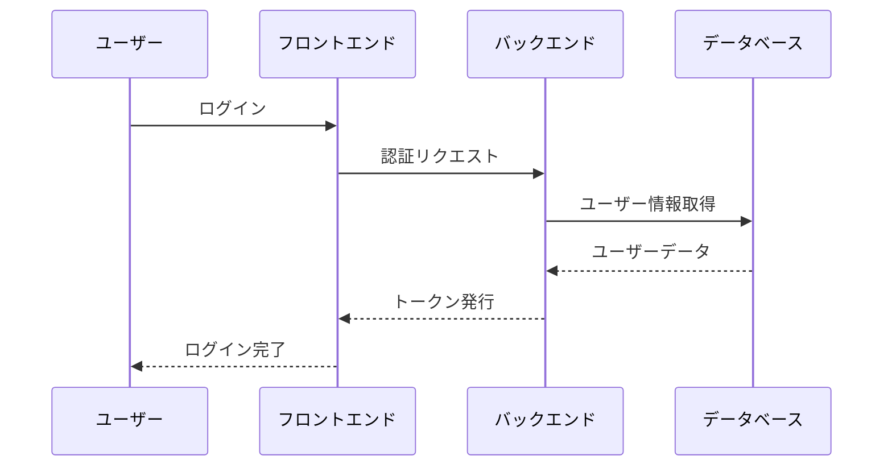

# 図表作成規約

このドキュメントは、プロジェクト全体で統一された図表の作成方法を定義します。

## Mermaidの使用

- ドキュメント内の図はMermaidで記述する
- 画像ファイルではなくテキストベースの図を優先する
- 複雑な図は適切に分割する

## 対応する図の種類



## 使用例

### システム構成図

Mermaidを使用したシステム構成図の例：



マークダウンでは以下のように記述します：

    ```mermaid
    graph TD
        A[フロントエンド<br/>React] --> B[API<br/>REST]
        B --> C[バックエンド<br/>NestJS]
        C --> D[(データベース<br/>DynamoDB)]
    ```

### シーケンス図

シーケンス図の例：



マークダウンでは以下のように記述します：

    ```mermaid
    sequenceDiagram
        participant U as ユーザー
        participant F as フロントエンド
        participant B as バックエンド
        participant D as データベース
        
        U->>F: ログイン
        F->>B: 認証リクエスト
        B->>D: ユーザー情報取得
        D-->>B: ユーザーデータ
        B-->>F: トークン発行
        F-->>U: ログイン完了
    ```
