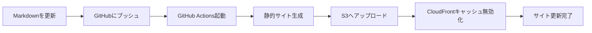

# 静的サイトデプロイ方針

本ドキュメントは、ドキュメント静的サイトのホスティングとデプロイ方法を説明します。

## 概要

ユーザーマニュアルとリリースノートを静的サイトとして提供します。

### 基本方針

- 認証なしで誰でもアクセス可能
- HTTPS対応必須
- 高速な表示（CloudFront CDN活用）
- 自動デプロイ（CI/CD）
- フロントエンドアプリケーションから検索可能

---

## ホスティングオプション

### 1. AWS S3 + CloudFront（推奨）

**メリット**:
- AWSエコシステムとの統合
- CloudFront CDNで高速グローバル配信
- 低コスト（静的ファイルホスティング）
- 高可用性とスケーラビリティ
- カスタムドメイン対応

**概算コスト**: 月額 $1-5（トラフィック次第）

**構成**:
- **S3**: 静的ファイルホスティング
- **CloudFront**: CDN配信、HTTPS対応
- **Route 53**: カスタムドメイン（オプション）

**設定方法**:
```yaml
# .github/workflows/deploy-docs.yml
name: Deploy Documentation

on:
  push:
    branches:
      - main
    paths:
      - 'docs/**'
      - 'sites/**'

jobs:
  deploy:
    runs-on: ubuntu-latest
    steps:
      - uses: actions/checkout@v4
      
      - name: Setup Python
        uses: actions/setup-python@v4
        with:
          python-version: '3.x'
      
      - name: Install MkDocs
        run: |
          pip install mkdocs-material
      
      - name: Build docs
        run: |
          cd sites/user-docs
          mkdocs build
      
      - name: Configure AWS credentials
        uses: aws-actions/configure-aws-credentials@v4
        with:
          aws-access-key-id: ${{ secrets.AWS_ACCESS_KEY_ID }}
          aws-secret-access-key: ${{ secrets.AWS_SECRET_ACCESS_KEY }}
          aws-region: ap-northeast-1
      
      - name: Deploy to S3
        run: |
          aws s3 sync sites/user-docs/site/ s3://docs-bucket/ --delete
      
      - name: Invalidate CloudFront cache
        run: |
          aws cloudfront create-invalidation \
            --distribution-id ${{ secrets.CLOUDFRONT_DISTRIBUTION_ID }} \
            --paths "/*"
```

**S3バケット設定**:
```json
{
  "Version": "2012-10-17",
  "Statement": [
    {
      "Sid": "PublicReadGetObject",
      "Effect": "Allow",
      "Principal": "*",
      "Action": "s3:GetObject",
      "Resource": "arn:aws:s3:::docs-bucket/*"
    }
  ]
}
```

**CloudFront設定**:
- **Origin**: S3バケット
- **Viewer Protocol Policy**: Redirect HTTP to HTTPS
- **Compress Objects Automatically**: Yes
- **Default Root Object**: index.html
- **Custom Error Responses**: 404 → /404.html

**公開URL**: `https://d1234567890abc.cloudfront.net` または `https://docs.example.com`

### 2. GitHub Pages（代替案）

**メリット**:
- 完全無料
- GitHubリポジトリと統合
- 自動デプロイ可能
- HTTPS対応

**公開URL**: `https://<username>.github.io/<repository>/`

**設定方法**:
```yaml
# .github/workflows/deploy-docs.yml
name: Deploy Documentation

on:
  push:
    branches:
      - main
    paths:
      - 'docs/**'
      - 'static-sites/**'

jobs:
  deploy:
    runs-on: ubuntu-latest
    steps:
      - uses: actions/checkout@v4
      
      - name: Setup Python
        uses: actions/setup-python@v4
        with:
          python-version: '3.x'
      
      - name: Install MkDocs
        run: |
          pip install mkdocs-material
      
      - name: Build docs
        run: |
          cd sites/user-docs
          mkdocs build
      
      - name: Deploy to GitHub Pages
        uses: peaceiris/actions-gh-pages@v3
        with:
          github_token: ${{ secrets.GITHUB_TOKEN }}
          publish_dir: ./sites/user-docs/site
```

**カスタムドメイン設定**:
1. リポジトリ設定から「Pages」セクションへ移動
2. 「Custom domain」にドメインを入力
3. DNSレコードを設定:
   ```
   CNAME docs.example.com -> <username>.github.io
   ```

### 3. Vercel（代替案）

**メリット**:
- 高速なCDN
- プレビュー環境自動生成
- カスタムドメイン対応
- 無料プランあり

**公開URL**: `https://<project-name>.vercel.app`

**設定方法**:
```json
// vercel.json
{
  "buildCommand": "cd sites/user-docs && mkdocs build",
  "outputDirectory": "sites/user-docs/site",
  "devCommand": "cd sites/user-docs && mkdocs serve"
}
```

### 4. Netlify（代替案）

**メリット**:
- 簡単なデプロイ設定
- フォームやリダイレクト機能
- プレビューデプロイ
- 無料プランあり

**公開URL**: `https://<site-name>.netlify.app`

**設定方法**:
```toml
# netlify.toml
[build]
  command = "cd sites/user-docs && mkdocs build"
  publish = "sites/user-docs/site"

[[redirects]]
  from = "/*"
  to = "/index.html"
  status = 200
```

---

## フロントエンドからの検索機能

静的サイトの検索は、フロントエンドアプリケーションから利用可能です。

### 実装方法

#### 1. 検索インデックスの生成

MkDocsは自動的に検索インデックスを生成します：

```yaml
# mkdocs.yml
plugins:
  - search:
      lang: ja
      separator: '[\s\-\.]+'
```

生成されるファイル: `site/search/search_index.json`

#### 2. フロントエンドからの検索

```typescript
// フロントエンドアプリケーションからドキュメント検索
import axios from 'axios';

interface SearchResult {
  title: string;
  text: string;
  location: string;
}

export async function searchDocs(query: string): Promise<SearchResult[]> {
  const docsUrl = process.env.REACT_APP_DOCS_URL || 'https://docs.example.com';
  
  // 検索インデックスを取得
  const response = await axios.get(`${docsUrl}/search/search_index.json`);
  const index = response.data;
  
  // クライアント側で検索実行
  const results: SearchResult[] = [];
  const searchTerm = query.toLowerCase();
  
  for (const [location, doc] of Object.entries(index.docs)) {
    const docData = doc as { title: string; text: string };
    if (
      docData.title.toLowerCase().includes(searchTerm) ||
      docData.text.toLowerCase().includes(searchTerm)
    ) {
      results.push({
        title: docData.title,
        text: docData.text.substring(0, 200) + '...',
        location: `${docsUrl}/${location}`,
      });
    }
  }
  
  return results.slice(0, 10); // 上位10件を返す
}
```

#### 3. 検索UIコンポーネント

```typescript
// SearchDocs.tsx
import React, { useState } from 'react';
import { searchDocs } from './searchService';

export const SearchDocs: React.FC = () => {
  const [query, setQuery] = useState('');
  const [results, setResults] = useState([]);
  const [loading, setLoading] = useState(false);
  
  const handleSearch = async () => {
    if (!query.trim()) return;
    
    setLoading(true);
    try {
      const searchResults = await searchDocs(query);
      setResults(searchResults);
    } catch (error) {
      console.error('ドキュメント検索エラー:', error);
    } finally {
      setLoading(false);
    }
  };
  
  return (
    <div className="docs-search">
      <input
        type="search"
        value={query}
        onChange={(e) => setQuery(e.target.value)}
        onKeyPress={(e) => e.key === 'Enter' && handleSearch()}
        placeholder="ドキュメントを検索..."
      />
      <button onClick={handleSearch} disabled={loading}>
        {loading ? '検索中...' : '検索'}
      </button>
      
      <div className="search-results">
        {results.map((result, index) => (
          <div key={index} className="result-item">
            <h3>
              <a href={result.location} target="_blank" rel="noopener noreferrer">
                {result.title}
              </a>
            </h3>
            <p>{result.text}</p>
          </div>
        ))}
      </div>
    </div>
  );
};
```

### CORS設定

S3 + CloudFrontでフロントエンドから検索インデックスにアクセスする場合、CORS設定が必要です：

```json
// S3バケットCORS設定
[
  {
    "AllowedHeaders": ["*"],
    "AllowedMethods": ["GET", "HEAD"],
    "AllowedOrigins": ["https://your-app-domain.com"],
    "ExposeHeaders": ["ETag"],
    "MaxAgeSeconds": 3000
  }
]
```

---

## デプロイフロー

### 自動デプロイ



### 手動デプロイ

```bash
# MkDocsの場合
cd static-sites/user-docs
mkdocs build
mkdocs gh-deploy

# VitePressの場合
cd static-sites/user-docs
npm run docs:build
# 生成されたdist/をホスティング先へアップロード
```

---

## 環境別デプロイ

### 開発環境
- **ブランチ**: `develop`
- **URL**: `https://dev-docs.example.com`
- **用途**: 開発中のドキュメント確認

### ステージング環境
- **ブランチ**: `staging`
- **URL**: `https://staging-docs.example.com`
- **用途**: リリース前の最終確認

### 本番環境
- **ブランチ**: `main`
- **URL**: `https://docs.example.com`
- **用途**: ユーザーに公開

---

## デプロイ監視

### デプロイステータスの確認

```yaml
# GitHub Actions バッジ

```

### デプロイ通知

Slack通知の設定例:
```yaml
- name: Notify Slack
  if: always()
  uses: 8398a7/action-slack@v3
  with:
    status: ${{ job.status }}
    text: 'ドキュメントのデプロイが完了しました'
    webhook_url: ${{ secrets.SLACK_WEBHOOK }}
```

---

## セキュリティ

### 公開情報の管理
- 機密情報は含めない
- APIキーやパスワードは除外
- 内部システムの詳細は公開しない

### HTTPS必須
- すべてのホスティングでHTTPSを有効化
- mixed contentエラーを防ぐ

### アクセス制限（必要な場合）

**Netlify基本認証**:
```toml
[[headers]]
  for = "/*"
  [headers.values]
    Basic-Auth = "username:password"
```

**Vercel認証**:
```json
{
  "password": {
    "mode": "basic",
    "username": "admin",
    "password": "secure-password"
  }
}
```

---

## 運用とメンテナンス

### 定期的な更新
- 週次または月次でドキュメントレビュー
- 古い情報の更新
- リンク切れの修正

### バージョン管理

**mikeを使用したバージョニング**:
```yaml
# mkdocs.yml
extra:
  version:
    provider: mike
    default: latest

plugins:
  - mike:
      version_selector: true
```

デプロイコマンド：
```bash
# バージョン 1.0 をデプロイ
mike deploy 1.0 latest --update-aliases

# バージョン一覧
mike list
```

### アクセス分析

**Google Analytics導入**:
```yaml
# mkdocs.yml
extra:
  analytics:
    provider: google
    property: G-XXXXXXXXXX
```

---

## パフォーマンス最適化

### CDN活用
- CloudFront（AWS）
- Fastly（Netlify）
- Vercel Edge Network

### キャッシュ戦略

```yaml
# Netlifyキャッシュ設定
[[headers]]
  for = "/*.html"
  [headers.values]
    Cache-Control = "public, max-age=0, must-revalidate"

[[headers]]
  for = "/assets/*"
  [headers.values]
    Cache-Control = "public, max-age=31536000, immutable"
```

### 静的ファイル圧縮

```bash
# ビルド後の圧縮
find site -name "*.html" -exec gzip -k {} \;
find site -name "*.css" -exec gzip -k {} \;
find site -name "*.js" -exec gzip -k {} \;
```

---

## トラブルシューティング

### ビルドエラー

```bash
# ローカルでビルドテスト
mkdocs build --strict

# エラーログを確認
mkdocs build --verbose
```

### リンク切れチェック

```bash
# リンクチェックツール
npm install -g broken-link-checker
blc https://your-docs-site.com -ro
```

### キャッシュクリア

```yaml
# GitHub Actionsでキャッシュをクリア
- name: Clear cache
  run: |
    rm -rf ~/.cache/pip
    pip cache purge
```

---

## 次のステップ

- [ビルド方針](../build/STATIC_SITE.md) - 静的サイトのビルド設定
- [アプリ連携](../implement/STATIC_SITE.md) - アプリケーションからのリンク方法

---

**最終更新日**: 2025年12月  
**バージョン**: 1.0.0
