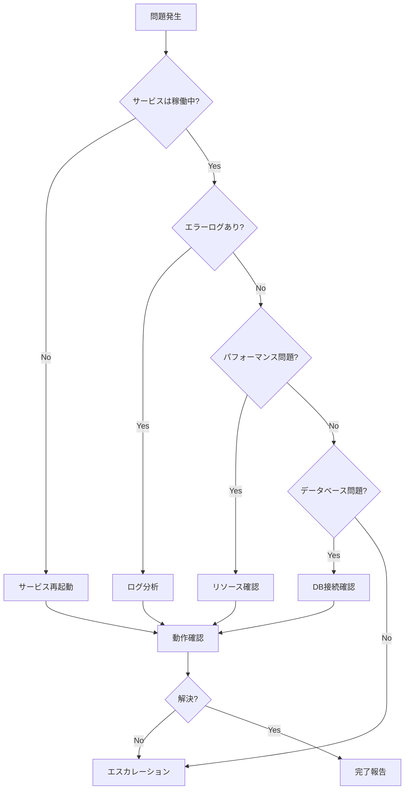
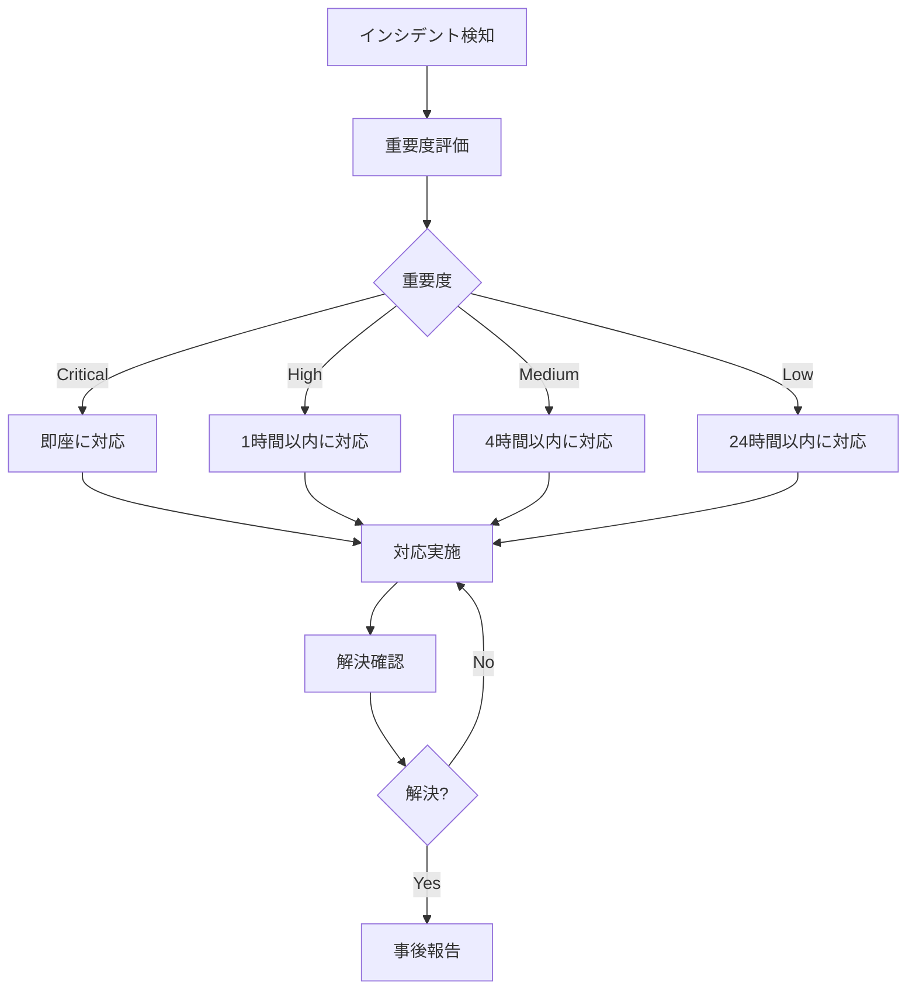

# 運用管理ガイド

本ドキュメントは、システムの運用管理プロセスと日常的な運用タスクを説明します。

**関連ドキュメント**: 
- [システムアーキテクチャ設計書](../implement/)
- [デプロイ戦略](../deploy/)
- [監視戦略](../monitor/)

## 目次

1. [概要](#概要)
2. [日常運用タスク](#日常運用タスク)
3. [システムメンテナンス](#システムメンテナンス)
4. [トラブルシューティング](#トラブルシューティング)
5. [バックアップとリストア](#バックアップとリストア)
6. [セキュリティ運用](#セキュリティ運用)
7. [パフォーマンス管理](#パフォーマンス管理)
8. [インシデント対応](#インシデント対応)

---

## 概要

本システムの運用管理は、システムの安定稼働、パフォーマンスの維持、セキュリティの確保を目的とします。

### 運用の基本原則

- **可用性**: システムの高可用性を維持
- **信頼性**: データの整合性と正確性を保証
- **安全性**: セキュリティインシデントの予防と対応
- **効率性**: リソースの最適化
- **保守性**: システムの持続可能な運用

---

## 日常運用タスク

### 毎日のチェックリスト

#### 朝（9:00）

```bash
# 1. システムヘルスチェック
curl https://api.example.com/health

# 2. アプリケーションログ確認
tail -n 100 /var/log/application.log | grep -i error

# 3. データベース接続確認
psql -h localhost -U user -d attendance_db -c "SELECT 1;"

# 4. ディスク使用量確認
df -h

# 5. メモリ使用量確認
free -h
```

#### 夕方（18:00）

```bash
# 1. アクセスログ分析
tail -n 1000 /var/log/access.log | awk '{print $1}' | sort | uniq -c | sort -nr | head -10

# 2. エラー集計
grep -c "ERROR" /var/log/application.log

# 3. データベースパフォーマンス確認
psql -U user -d attendance_db -c "
  SELECT query, calls, total_exec_time, mean_exec_time
  FROM pg_stat_statements
  ORDER BY mean_exec_time DESC
  LIMIT 10;
"

# 4. バックアップ確認
ls -lh /backups/ | tail -5
```

### 週次タスク

#### 毎週月曜日

- [ ] 週次レポート確認
- [ ] ディスク容量の確認と不要ファイルの削除
- [ ] ログローテーション確認
- [ ] SSL証明書の有効期限確認（残り30日以下で警告）
- [ ] 依存関係の脆弱性スキャン

```bash
# SSL証明書確認
echo | openssl s_client -servername example.com -connect example.com:443 2>/dev/null | openssl x509 -noout -dates

# 依存関係スキャン
cd backend && npm audit
cd frontend && npm audit
```

### 月次タスク

#### 毎月1日

- [ ] 月次パフォーマンスレポート作成
- [ ] データベースバックアップの検証
- [ ] アクセスログのアーカイブ
- [ ] ユーザーアカウントの監査
- [ ] セキュリティパッチの適用計画

```bash
# ログアーカイブ
tar -czf logs_$(date +%Y%m).tar.gz /var/log/*.log
mv logs_$(date +%Y%m).tar.gz /archives/

# データベースバックアップ検証
pg_restore --list backup_latest.dump > /tmp/backup_contents.txt
```

---

## システムメンテナンス

### 定期メンテナンス

#### データベースメンテナンス

```bash
# 1. VACUUM実行（週次）
psql -U user -d attendance_db -c "VACUUM ANALYZE;"

# 2. インデックスの再構築（月次）
psql -U user -d attendance_db -c "REINDEX DATABASE attendance_db;"

# 3. 統計情報の更新
psql -U user -d attendance_db -c "ANALYZE;"

# 4. 不要なデータの削除（古いセッション、ログなど）
psql -U user -d attendance_db -c "
  DELETE FROM sessions WHERE updated_at < NOW() - INTERVAL '30 days';
"
```

#### アプリケーションメンテナンス

```bash
# 1. ログローテーション
logrotate /etc/logrotate.d/application

# 2. 一時ファイルの削除
find /tmp -name "*.tmp" -mtime +7 -delete

# 3. キャッシュのクリア
redis-cli FLUSHDB

# 4. アプリケーションの再起動（必要時）
systemctl restart attendance-backend
```

### 計画的メンテナンス

#### メンテナンス手順

```markdown
# メンテナンス計画書

**日時**: 2024年12月25日 02:00-04:00 JST
**担当者**: 運用チーム
**目的**: データベースアップグレード

## 事前準備
- [ ] ユーザーへの通知（1週間前）
- [ ] バックアップの取得
- [ ] ロールバック手順の確認
- [ ] メンテナンスページの準備

## 実施手順
1. システム監視を強化
2. バックアップ取得
3. メンテナンスモードに切り替え
4. データベースアップグレード実行
5. 動作確認
6. 通常モードに復帰

## ロールバック条件
- データベース接続エラー
- データ整合性の問題
- 予定時間を30分以上超過

## 完了確認
- [ ] ヘルスチェックOK
- [ ] ログにエラーがない
- [ ] パフォーマンス問題なし
- [ ] ユーザーへの完了通知
```

---

## トラブルシューティング

### 一般的な問題と解決方法

#### 1. アプリケーションが応答しない

```bash
# サービスの状態確認
systemctl status attendance-backend

# プロセス確認
ps aux | grep node

# ポート確認
netstat -tlnp | grep 3000

# ログ確認
tail -f /var/log/application.log

# 再起動
systemctl restart attendance-backend
```

#### 2. データベース接続エラー

```bash
# PostgreSQL状態確認
systemctl status postgresql

# 接続数確認
psql -U user -d attendance_db -c "
  SELECT count(*) FROM pg_stat_activity;
"

# 接続数制限確認
psql -U user -d attendance_db -c "
  SHOW max_connections;
"

# 長時間実行中のクエリ確認
psql -U user -d attendance_db -c "
  SELECT pid, now() - query_start as duration, query
  FROM pg_stat_activity
  WHERE state = 'active'
  ORDER BY duration DESC;
"

# 問題のあるクエリを停止
psql -U user -d attendance_db -c "SELECT pg_terminate_backend(pid);"
```

#### 3. メモリ不足

```bash
# メモリ使用状況確認
free -h
top -o %MEM

# プロセスごとのメモリ使用量
ps aux --sort=-%mem | head -10

# ログ確認（OOM Killer）
dmesg | grep -i "out of memory"

# 対処: 不要なプロセスを停止
kill -9 <pid>

# Node.jsのメモリ制限を増やす
NODE_OPTIONS="--max-old-space-size=4096" node dist/main.js
```

#### 4. ディスク容量不足

```bash
# ディスク使用量確認
df -h

# 大きなファイル検索
du -sh /* | sort -rh | head -10

# 古いログファイル削除
find /var/log -name "*.log.*" -mtime +30 -delete

# データベースの不要データ削除
psql -U user -d attendance_db -c "VACUUM FULL;"
```

#### 5. パフォーマンス低下

```bash
# CPU使用率確認
top
htop

# スロークエリログ確認
tail -f /var/log/postgresql/postgresql.log | grep "duration:"

# アプリケーションプロファイリング
# Node.js --inspect フラグを使用してデバッグ
node --inspect dist/main.js

# データベースクエリ分析
EXPLAIN ANALYZE SELECT * FROM attendances WHERE user_id = 1;
```

### トラブルシューティングフローチャート



---

## バックアップとリストア

### バックアップ戦略

#### 自動バックアップ設定

```bash
# バックアップスクリプト
#!/bin/bash
# /usr/local/bin/backup-db.sh

DATE=$(date +%Y%m%d_%H%M%S)
BACKUP_DIR="/backups/database"
DB_NAME="attendance_db"
RETENTION_DAYS=30

# フルバックアップ
pg_dump -h localhost -U user -F c -b -v -f "$BACKUP_DIR/full_$DATE.dump" $DB_NAME

# 圧縮
gzip "$BACKUP_DIR/full_$DATE.dump"

# 古いバックアップ削除
find $BACKUP_DIR -name "full_*.dump.gz" -mtime +$RETENTION_DAYS -delete

# バックアップ検証
if [ $? -eq 0 ]; then
  echo "Backup successful: full_$DATE.dump.gz"
else
  echo "Backup failed!" | mail -s "Backup Alert" admin@example.com
fi
```

#### Cron設定

```bash
# crontab -e
# 毎日午前2時にバックアップ実行
0 2 * * * /usr/local/bin/backup-db.sh

# 毎週日曜日午前3時にフルバックアップ
0 3 * * 0 /usr/local/bin/full-backup.sh
```

### リストア手順

```bash
# 1. データベース停止（安全のため）
systemctl stop attendance-backend

# 2. 現在のデータベースをバックアップ
pg_dump -h localhost -U user -F c attendance_db > current_backup.dump

# 3. データベース削除と再作成
psql -U user -c "DROP DATABASE attendance_db;"
psql -U user -c "CREATE DATABASE attendance_db;"

# 4. バックアップからリストア
pg_restore -h localhost -U user -d attendance_db -v backup_20241219.dump.gz

# 5. 整合性確認
psql -U user -d attendance_db -c "
  SELECT COUNT(*) FROM users;
  SELECT COUNT(*) FROM attendances;
"

# 6. アプリケーション起動
systemctl start attendance-backend

# 7. 動作確認
curl https://api.example.com/health
```

---

## セキュリティ運用

### セキュリティチェックリスト

#### 日次

- [ ] 不審なログイン試行の確認
- [ ] エラーログのセキュリティイベント確認
- [ ] ファイアウォールログの確認

```bash
# 不審なログイン試行
grep "Failed password" /var/log/auth.log | tail -20

# 複数回失敗したIPアドレス
grep "Failed password" /var/log/auth.log | awk '{print $(NF-3)}' | sort | uniq -c | sort -nr
```

#### 週次

- [ ] SSL/TLS証明書の確認
- [ ] 依存関係の脆弱性スキャン
- [ ] アクセス権限の監査

```bash
# 依存関係スキャン
npm audit
npm audit fix

# SSL証明書確認
openssl x509 -in /etc/ssl/certs/example.com.crt -noout -dates
```

#### 月次

- [ ] ユーザーアカウントの監査
- [ ] セキュリティパッチの適用
- [ ] セキュリティログの分析

### セキュリティインシデント対応

```markdown
# セキュリティインシデント対応手順

## フェーズ1: 検知
- アラートの確認
- インシデントの種類特定
- 影響範囲の評価

## フェーズ2: 封じ込め
- 攻撃元のブロック
- 影響を受けたシステムの隔離
- 緊急パッチの適用

## フェーズ3: 根絶
- 脆弱性の修正
- マルウェアの除去
- システムの再構築（必要時）

## フェーズ4: 復旧
- システムの復元
- 監視の強化
- 動作確認

## フェーズ5: 事後分析
- インシデントレポート作成
- 再発防止策の策定
- チームへの共有
```

---

## パフォーマンス管理

### パフォーマンス監視

```bash
# アプリケーションパフォーマンス
# レスポンスタイム測定
curl -w "@curl-format.txt" -o /dev/null -s https://api.example.com/health

# curl-format.txt
time_namelookup:  %{time_namelookup}\n
time_connect:  %{time_connect}\n
time_appconnect:  %{time_appconnect}\n
time_pretransfer:  %{time_pretransfer}\n
time_redirect:  %{time_redirect}\n
time_starttransfer:  %{time_starttransfer}\n
----------\n
time_total:  %{time_total}\n

# データベースパフォーマンス
psql -U user -d attendance_db -c "
  SELECT schemaname, tablename, 
         pg_size_pretty(pg_total_relation_size(schemaname||'.'||tablename)) AS size
  FROM pg_tables
  ORDER BY pg_total_relation_size(schemaname||'.'||tablename) DESC
  LIMIT 10;
"
```

### パフォーマンスチューニング

#### データベース最適化

```sql
-- インデックス作成
CREATE INDEX idx_attendances_user_id ON attendances(user_id);
CREATE INDEX idx_attendances_date ON attendances(attendance_date);

-- クエリ最適化
EXPLAIN ANALYZE SELECT * FROM attendances WHERE user_id = 1;

-- 接続プール設定
ALTER SYSTEM SET max_connections = 200;
ALTER SYSTEM SET shared_buffers = '256MB';
ALTER SYSTEM SET effective_cache_size = '1GB';
```

---

## インシデント対応

### インシデント管理フロー



### インシデントレポートテンプレート

```markdown
# インシデントレポート

**インシデントID**: INC-2024-001
**発生日時**: 2024-12-19 10:30 JST
**検知日時**: 2024-12-19 10:35 JST
**復旧日時**: 2024-12-19 11:00 JST
**重要度**: High

## 概要
データベース接続プールが枯渇し、APIが応答しなくなった。

## 影響範囲
- 影響を受けたサービス: API Server
- 影響を受けたユーザー: 全ユーザー
- ダウンタイム: 30分

## 原因
接続プールの設定が不適切で、長時間実行されるクエリによりコネクションがリークした。

## 対応内容
1. 長時間実行中のクエリを停止
2. アプリケーションサーバーを再起動
3. 接続プール設定を最適化

## 再発防止策
- 接続プールのタイムアウト設定を追加
- スロークエリの監視を強化
- 定期的なコネクション監視の実装

## 教訓
- データベース接続の適切な管理が重要
- 監視アラートの閾値を見直す必要がある
```

---

## ベストプラクティス

1. **自動化**: 可能な限り運用タスクを自動化
2. **ドキュメント化**: 運用手順を常に最新に保つ
3. **監視**: 継続的なシステム監視
4. **バックアップ**: 定期的なバックアップと検証
5. **セキュリティ**: セキュリティパッチの適用
6. **ログ管理**: ログの適切な管理と分析
7. **キャパシティプランニング**: リソースの計画的な管理
8. **インシデント管理**: 迅速な問題対応
9. **変更管理**: 計画的な変更実施
10. **チーム連携**: 関係者間の効果的なコミュニケーション

---

## 関連ドキュメント

- [システムアーキテクチャ設計書](../implement/)
- [デプロイ戦略](../deploy/)
- [監視戦略](../monitor/)
- [リリース管理](../release/)

---

**最終更新日**: 2024年12月19日  
**バージョン**: 1.0.0  
**ドキュメント管理者**: 運用チーム
