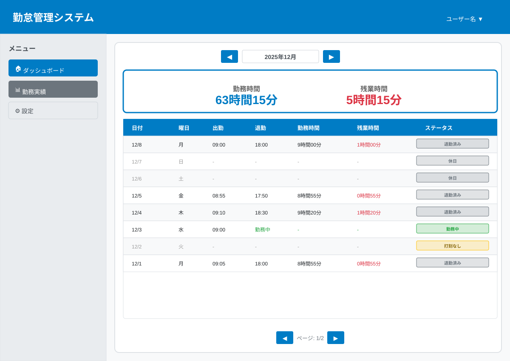

# 勤怠履歴機能リファレンス

## 概要

自分の過去の勤怠記録を確認できます。月単位で表示し、出勤・退勤時刻や勤務時間を一覧できます。

## 前提条件

- システムにログインしている

## 操作手順

### 勤怠履歴の表示

1. 左側のメニューから**「勤怠履歴」**をクリックします
2. 自分の勤怠記録一覧が表示されます

### 表示月の変更

1. 画面上部の月選択エリアで、**前月ボタン (◀)** または **次月ボタン (▶)** をクリックします
2. 選択した月の勤怠記録が表示されます

## 表示項目

勤怠履歴には以下の情報が表示されます:

| 項目 | 説明 |
|------|------|
| 日付 | 勤務日（YYYY/MM/DD形式） |
| 出勤時刻 | 出勤を打刻した時刻（HH:MM:SS形式） |
| 退勤時刻 | 退勤を打刻した時刻（HH:MM:SS形式） |
| 勤務時間 | 自動計算された勤務時間（◯時間◯◯分） |
| ステータス | 勤務状況 |

### ステータスの種類

- **勤務中**: 出勤打刻済み、退勤打刻未実施
- **退勤済み**: 出勤・退勤の両方が打刻済み
- **打刻なし**: その日に打刻記録がない（未入力日）

### 未入力日の表示

- 打刻記録がない日も一覧に表示されます
- 未入力日は灰色のテキストで表示され、時刻は「-」で表示されます
- ステータスは「打刻なし」と表示されます

## 表示機能

### ソート

- 日付は降順（新しい順）で表示されます
- 各列のヘッダーをクリックすると、その列で並び替えができます

### ページネーション

- 1ページあたり最大30件の記録が表示されます
- 複数ページある場合は、画面下部にページ番号が表示されます

### 月次サマリー

- 画面下部に、表示月の合計勤務時間が表示されます
- 例: 「合計勤務時間（12月）: 63時間15分」

## よくある質問

### Q: 勤怠履歴が表示されません

**A:** 以下を確認してください:
- ログインは正常にできていますか？
- 過去に打刻記録がありますか？
- 表示月が正しいですか？

問題が解決しない場合は、管理者に連絡してください。

### Q: 過去の勤怠記録はいつまで遡って確認できますか？

**A:** 入社日以降のすべての勤怠記録を確認できます。データの保存期限はありません。

### Q: 他の人の勤怠記録を見ることはできますか？

**A:** いいえ、セキュリティとプライバシー保護のため、自分自身の勤怠記録のみ閲覧可能です。

### Q: 勤怠データをダウンロードできますか？

**A:** 現バージョンではダウンロード機能はありません。

### Q: 勤務時間が正しく計算されない

**症状**: 表示されている勤務時間が実際と異なる

**対処法**:
1. 出勤・退勤時刻が正しく記録されているか確認
2. 時刻はシステム時刻に基づいているため、端末の時刻設定を確認
3. 管理者に連絡して確認を依頼

## 注意事項

- 表示されるのは自分自身の勤怠記録のみです
- 勤怠記録の修正はできません。誤りがある場合は管理者に連絡してください
- 月をまたいだ期間の集計は表示されません（月単位のみ）

## 関連ページ

- [出勤・退勤打刻機能](clock-in-out.md)
- [スタートアップガイド](../guides/startup.md)
- [トラブルシューティング](../guides/troubleshooting.md)
