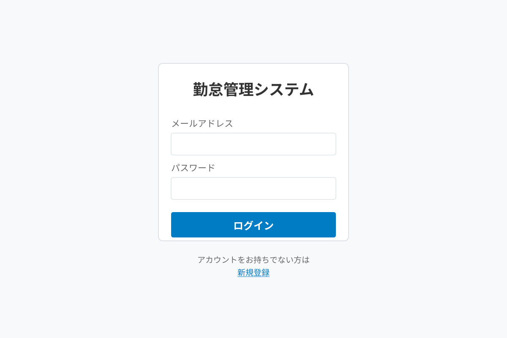

# ログイン機能リファレンス

## 概要

メールアドレスとパスワードを使用してシステムにログインします。

## 前提条件

- システムのURLを知っている
- ユーザー登録が完了している（メールアドレスとパスワードを設定済み）
- 対応ブラウザ（Chrome, Firefox, Edge, Safari の最新版）

## 操作手順

1. ブラウザでシステムのURLにアクセスします
2. ログイン画面が表示されます

3. **メールアドレス**を入力します
4. **パスワード**を入力します
5. **ログイン**ボタンをクリックします
6. ログインに成功すると、メインダッシュボードに移動します

### 初めて利用する場合

アカウントをお持ちでない場合は、「新規登録」リンクから[ユーザー登録](user-registration.md)を行ってください。

## 入力項目

### メールアドレス
- **必須**: はい
- **形式**: 有効なメールアドレス形式
- **大文字小文字**: 区別しません
- **説明**: ユーザー登録時に使用したメールアドレス

### パスワード
- **必須**: はい
- **形式**: 半角英数字・記号
- **大文字小文字**: 区別します
- **説明**: ユーザー登録時に設定したパスワード

## 注意事項

⚠️ **セキュリティ**
- パスワードは大文字・小文字を区別します
- 複数回ログインに失敗すると、アカウントが一時的にロックされます（15分間）
- 共有PCを使用する場合は、作業終了後に必ずログアウトしてください

## エラーと対処法

### ログインできない場合

**症状**: メールアドレスとパスワードを入力してもログインできない

**原因と対処法**:

1. **メールアドレスまたはパスワードの誤入力**
   - メールアドレスとパスワードに誤りがないか確認
   - パスワードの大文字・小文字が正しいか確認
   - Caps Lockがオンになっていないか確認

2. **アカウント未登録またはメール未確認**
   - ユーザー登録が完了しているか確認
   - 登録時の確認メールでメールアドレスを確認済みか確認
   
3. **アカウントロック**
   - 複数回失敗している場合は、15分待ってから再試行
   
4. **ブラウザの問題**
   - キャッシュをクリア（Ctrl + F5 または Cmd + Shift + R）
   - 別のブラウザで試してみる
   - JavaScriptが有効になっているか確認

5. **その他**
   - それでも解決しない場合は管理者に連絡

## 関連ページ

- [ユーザー登録機能](user-registration.md)
- [ログアウト機能](logout.md)
- [スタートアップガイド](../guides/startup.md)
- [トラブルシューティング](../guides/troubleshooting.md)
