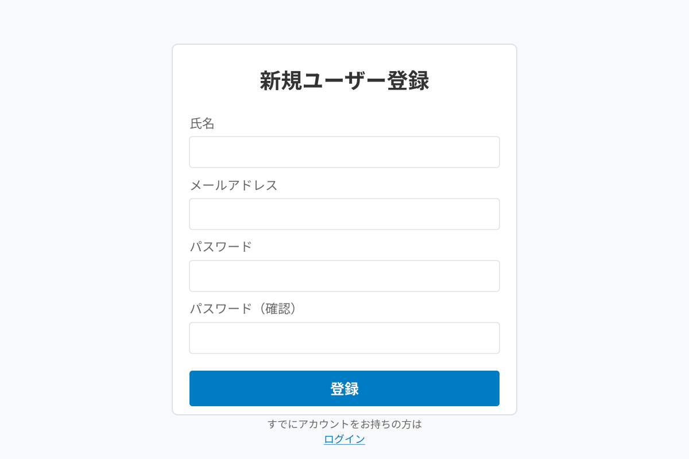

# ユーザー登録機能リファレンス

## 概要

新しいユーザーアカウントを作成し、システムを利用開始するための機能です。

## 前提条件

- 会社コードを知っている（会社の管理者から取得）
- メールアドレスを持っている
- 対応ブラウザ（Chrome, Firefox, Edge, Safari の最新版）

## 操作手順

### 登録画面へのアクセス

1. ログイン画面にアクセスします
2. 「新規登録」リンクをクリックします

### アカウント情報の入力

3. 以下の情報を入力します：

#### 必須項目

- **氏名**
  - 形式: 全角または半角
  - 例: 山田 太郎
  - 説明: あなたの氏名を入力してください

- **メールアドレス**
  - 形式: 有効なメールアドレス形式
  - 例: yamada.taro@company.com
  - 説明: ログインに使用するメールアドレス
  - 注意: このメールアドレスは他のユーザーと重複できません

- **パスワード**
  - 形式: 8文字以上、英数字と記号を含む
  - 説明: ログインに使用するパスワード
  - セキュリティ要件:
    - 最低8文字以上
    - 英大文字を1文字以上含む
    - 英小文字を1文字以上含む
    - 数字を1文字以上含む
    - 記号を含むことを推奨

- **パスワード（確認）**
  - 説明: 上記と同じパスワードを再入力
  - 目的: 入力ミスを防止

- **会社コード**
  - 形式: 英数字
  - 例: ABC123
  - 説明: 会社から発行された固有のコード
  - 取得方法: 会社の管理者に問い合わせてください

4. すべての項目を入力後、**「登録」**ボタンをクリックします

### 登録完了

5. 入力内容が正しければ、登録が完了します
6. 確認メールが登録したメールアドレスに送信されます
7. メール内のリンクをクリックして、メールアドレスを確認します
8. メールアドレス確認後、ログインできるようになります

## 入力項目の詳細

### 氏名

- **必須**: はい
- **最大文字数**: 50文字
- **使用可能文字**: 全角・半角英数字、漢字、ひらがな、カタカナ、スペース

### メールアドレス

- **必須**: はい
- **形式**: RFC 5322準拠のメールアドレス
- **一意性**: システム内で一意である必要があります
- **用途**: 
  - ログインID
  - システムからの通知受信

### パスワード

- **必須**: はい
- **最小文字数**: 8文字
- **推奨文字数**: 12文字以上
- **複雑さ要件**:
  - 英大文字（A-Z）: 必須
  - 英小文字（a-z）: 必須
  - 数字（0-9）: 必須
  - 記号（!@#$%など）: 推奨
- **禁止事項**:
  - メールアドレスと同じ文字列
  - 氏名と同じ文字列
  - 連続した文字（例: 123456、abcdef）
  - よく使われるパスワード（例: password、qwerty）

### 会社コード

- **必須**: はい
- **形式**: 英数字6-10文字
- **大文字小文字**: 区別しません
- **取得方法**: 会社の管理者に問い合わせ

## バリデーション

登録時に以下のチェックが行われます：

### 入力チェック

✅ すべての必須項目が入力されている
✅ メールアドレスが正しい形式である
✅ パスワードがセキュリティ要件を満たしている
✅ パスワードと確認用パスワードが一致している
✅ 会社コードが有効である

### データベースチェック

✅ メールアドレスが既に登録されていない
✅ 会社コードが存在する

## エラーと対処法

### メールアドレスが既に登録されています

**原因**: 入力したメールアドレスは既に他のユーザーが使用しています

**対処法**:
1. 別のメールアドレスを使用する
2. すでにアカウントを持っている場合は、ログイン画面からログインする
3. パスワードを忘れた場合は、パスワードリセット機能を使用する

### パスワードが要件を満たしていません

**原因**: パスワードがセキュリティ要件を満たしていません

**対処法**:
1. パスワードを8文字以上にする
2. 英大文字、英小文字、数字をすべて含める
3. 記号を追加する（推奨）
4. 簡単すぎるパスワードは避ける

### パスワードが一致しません

**原因**: パスワードと確認用パスワードが異なります

**対処法**:
1. 両方のフィールドに同じパスワードを入力する
2. Caps Lockがオンになっていないか確認する

### 会社コードが無効です

**原因**: 入力した会社コードが存在しないか、無効です

**対処法**:
1. 会社コードを正しく入力する
2. 会社の管理者に正しい会社コードを確認する
3. 会社コードの有効期限が切れていないか確認する

### 登録確認メールが届かない

**原因**: メールアドレスが間違っている、または迷惑メールフォルダに振り分けられている

**対処法**:
1. 迷惑メールフォルダを確認する
2. メールアドレスが正しいか確認する
3. しばらく待ってから再度確認する（最大10分程度）
4. それでも届かない場合は、管理者に連絡する

## セキュリティに関する注意事項

⚠️ **パスワードの管理**
- パスワードは他人に教えないでください
- 定期的にパスワードを変更してください
- 複数のサービスで同じパスワードを使い回さないでください

⚠️ **メールアドレスの確認**
- 登録後、必ずメールアドレス確認を完了してください
- 確認リンクの有効期限は24時間です

⚠️ **会社コードの取り扱い**
- 会社コードは会社の機密情報です
- 社外の人に教えないでください

## よくある質問

### Q: 登録は無料ですか？

**A:** はい、ユーザー登録は無料です。会社が契約している範囲内で利用できます。

### Q: 個人のメールアドレスを使えますか？

**A:** 会社のポリシーによります。管理者に確認してください。一般的には会社のメールアドレスの使用を推奨します。

### Q: 登録後すぐに使えますか？

**A:** メールアドレス確認を完了後、すぐに使用できます。確認リンクをクリックするまではログインできません。

### Q: 登録情報を変更できますか？

**A:** はい、ログイン後、設定画面から氏名やパスワードを変更できます。メールアドレスの変更は管理者に依頼してください。

### Q: 退職した場合はどうなりますか？

**A:** アカウントは自動的には削除されません。会社の管理者に連絡して、アカウントの無効化を依頼してください。

## 次のステップ

登録が完了したら：

1. [ログイン機能](login.md)を参照してログインする
2. [スタートアップガイド](../guides/startup.md)で基本的な使い方を学ぶ
3. [出勤・退勤打刻機能](clock-in-out.md)で打刻方法を確認する

## 関連ページ

- [ログイン機能](login.md)
- [スタートアップガイド](../guides/startup.md)
- [トラブルシューティング](../guides/troubleshooting.md)
