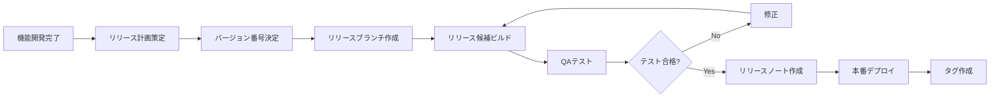

# リリース管理戦略

本ドキュメントは、システムのリリース管理プロセスとバージョン管理戦略を説明します。

**関連ドキュメント**: 
- [システムアーキテクチャ設計書](../implement/)
- [ビルド戦略](../build/)
- [デプロイ戦略](../deploy/)

## 目次

1. [概要](#概要)
2. [バージョニング戦略](#バージョニング戦略)
3. [リリースプロセス](#リリースプロセス)
4. [リリースノート](#リリースノート)
5. [ブランチ戦略](#ブランチ戦略)
6. [チェンジログ管理](#チェンジログ管理)
7. [ロールバック手順](#ロールバック手順)

---

## 概要

本システムのリリース管理は、**セマンティックバージョニング（Semantic Versioning）** に基づき、計画的かつ安全なリリースを実現します。

### リリースの種類

| リリース種別 | 説明 | 頻度 | 例 |
|------------|------|------|-----|
| **Major** | 破壊的変更を含む大規模アップデート | 年1-2回 | 1.0.0 → 2.0.0 |
| **Minor** | 新機能追加（後方互換性あり） | 月1-2回 | 1.0.0 → 1.1.0 |
| **Patch** | バグ修正、セキュリティパッチ | 週1回または必要時 | 1.0.0 → 1.0.1 |
| **Hotfix** | 緊急の本番環境修正 | 緊急時のみ | 1.0.1 → 1.0.2 |

---

## バージョニング戦略

### セマンティックバージョニング

バージョン番号は `MAJOR.MINOR.PATCH` の形式を採用します。

```
例: 2.3.5
    │ │ │
    │ │ └─ PATCH: バグ修正
    │ └─── MINOR: 新機能追加（後方互換）
    └───── MAJOR: 破壊的変更
```

### バージョンの決定基準

#### MAJOR バージョンアップ

- APIの破壊的変更
- データベーススキーマの大幅変更
- 主要な技術スタックの変更
- ユーザーインターフェースの全面刷新

#### MINOR バージョンアップ

- 新機能の追加
- 既存機能の拡張
- パフォーマンス改善
- 非破壊的なAPI追加

#### PATCH バージョンアップ

- バグ修正
- セキュリティパッチ
- ドキュメント修正
- 軽微なUI調整

### バージョン管理ファイル

#### package.json

```json
{
  "name": "attendance-system-frontend",
  "version": "1.2.3",
  "description": "勤怠管理システム フロントエンド"
}
```

#### バージョン情報の埋め込み

```typescript
// src/config/version.ts
export const VERSION = {
  major: 1,
  minor: 2,
  patch: 3,
  full: '1.2.3',
  buildDate: '2024-12-19',
  gitCommit: process.env.VITE_GIT_COMMIT || 'unknown'
};
```

---

## リリースプロセス

### 1. リリース計画



### 2. リリース手順

#### Step 1: リリースブランチ作成

```bash
# develop ブランチから リリースブランチを作成
git checkout develop
git pull origin develop
git checkout -b release/v1.2.0

# バージョン番号を更新
npm version minor --no-git-tag-version

# 変更をコミット
git add package.json package-lock.json
git commit -m "chore: bump version to 1.2.0"
git push origin release/v1.2.0
```

#### Step 2: リリース候補テスト

```bash
# ビルド実行
npm run build

# テスト実行
npm run test
npm run test:e2e

# セキュリティスキャン
npm audit
```

#### Step 3: リリースノート作成

```bash
# 前回のリリースからの変更を取得
git log v1.1.0..HEAD --oneline --pretty=format:"- %s (%h)"

# CHANGELOG.md を更新
# リリースノートを作成
```

#### Step 4: マージとタグ付け

```bash
# main ブランチにマージ
git checkout main
git merge --no-ff release/v1.2.0
git push origin main

# タグを作成
git tag -a v1.2.0 -m "Release version 1.2.0"
git push origin v1.2.0

# develop ブランチにもマージ
git checkout develop
git merge --no-ff release/v1.2.0
git push origin develop

# リリースブランチを削除
git branch -d release/v1.2.0
git push origin --delete release/v1.2.0
```

### 3. 自動化されたリリース

#### GitHub Actions設定

```yaml
# .github/workflows/release.yml
name: Release

on:
  push:
    tags:
      - 'v*'

jobs:
  release:
    runs-on: ubuntu-latest
    steps:
      - uses: actions/checkout@v4
        with:
          fetch-depth: 0
      
      - uses: actions/setup-node@v4
        with:
          node-version: '20'
      
      - name: Build
        run: |
          npm ci
          npm run build
      
      - name: Generate Changelog
        id: changelog
        uses: mikepenz/release-changelog-builder-action@v4
        env:
          GITHUB_TOKEN: ${{ secrets.GITHUB_TOKEN }}
      
      - name: Create Release
        uses: actions/create-release@v1
        env:
          GITHUB_TOKEN: ${{ secrets.GITHUB_TOKEN }}
        with:
          tag_name: ${{ github.ref }}
          release_name: Release ${{ github.ref }}
          body: ${{ steps.changelog.outputs.changelog }}
          draft: false
          prerelease: false
```

---

## リリースノート

### リリースノートテンプレート

```markdown
# Release v1.2.0

**リリース日**: 2024年12月19日

## 🎉 新機能

- 勤怠記録の一括エクスポート機能を追加
- ダッシュボードに月次統計グラフを追加
- プロフィール画像のアップロード機能

## 🐛 バグ修正

- 勤怠記録が重複して登録される問題を修正
- タイムゾーンの計算エラーを修正
- ログイン後のリダイレクト先が正しくない問題を修正

## 🔧 改善

- ページ読み込み速度を30%改善
- モバイル表示の最適化
- エラーメッセージをより分かりやすく改善

## 🔒 セキュリティ

- JWT トークンの有効期限チェック強化
- XSS 脆弱性対策の強化
- 依存関係のセキュリティアップデート

## ⚠️ 破壊的変更

なし

## 📝 アップグレードガイド

1. バックアップを取得してください
2. `npm install` で依存関係を更新
3. データベースマイグレーションを実行: `npm run migration:run`
4. アプリケーションを再起動

## 📊 統計

- コミット数: 45
- PR数: 12
- 貢献者: 5名
- 変更ファイル数: 87

## 🙏 謝辞

このリリースに貢献してくださった全ての方に感謝します。

---

**Full Changelog**: https://github.com/user/repo/compare/v1.1.0...v1.2.0
```

### リリースノートの自動生成

```bash
# conventional-changelog を使用
npm install -g conventional-changelog-cli

# CHANGELOG.md を自動生成
conventional-changelog -p angular -i CHANGELOG.md -s
```

---

## ブランチ戦略

### Git Flow ブランチモデル

```
main (本番環境)
  │
  ├─ release/v1.2.0 (リリース準備)
  │
develop (開発環境)
  │
  ├─ feature/new-feature (機能開発)
  ├─ feature/another-feature
  │
  └─ hotfix/critical-bug (緊急修正)
```

### ブランチの役割

| ブランチ | 用途 | 命名規則 |
|---------|------|---------|
| **main** | 本番環境のコード | `main` |
| **develop** | 次回リリースの統合 | `develop` |
| **feature** | 新機能開発 | `feature/feature-name` |
| **release** | リリース準備 | `release/v1.2.0` |
| **hotfix** | 緊急修正 | `hotfix/bug-description` |

---

## チェンジログ管理

### CHANGELOG.md の構造

```markdown
# Changelog

All notable changes to this project will be documented in this file.

The format is based on [Keep a Changelog](https://keepachangelog.com/en/1.0.0/),
and this project adheres to [Semantic Versioning](https://semver.org/spec/v2.0.0.html).

## [Unreleased]

### Added
- 開発中の新機能

### Changed
- 変更予定の機能

## [1.2.0] - 2024-12-19

### Added
- 勤怠記録の一括エクスポート機能
- ダッシュボードに月次統計グラフ

### Fixed
- 勤怠記録の重複登録問題
- タイムゾーン計算エラー

### Changed
- ページ読み込み速度を30%改善

### Security
- JWT トークンの有効期限チェック強化

## [1.1.0] - 2024-11-15

...
```

### コミットメッセージ規約

```bash
# Conventional Commits 形式
<type>(<scope>): <subject>

# 例
feat(auth): add password reset functionality
fix(attendance): correct timezone calculation
docs(readme): update installation instructions
chore(deps): update dependencies
```

---

## ロールバック手順

### 1. アプリケーションのロールバック

```bash
# 前のバージョンのタグをチェックアウト
git checkout v1.1.0

# ビルドして再デプロイ
npm run build
npm run deploy
```

### 2. データベースのロールバック

```bash
# マイグレーションを1つ戻す
npm run migration:revert

# 特定のバージョンまで戻す
npm run migration:revert -- --to=1234567890123
```

### 3. ロールバック後の確認

```bash
# アプリケーションの起動確認
npm run start:prod

# ヘルスチェック
curl http://localhost:3000/health

# ログの確認
tail -f logs/application.log
```

### 4. インシデント報告

```markdown
# インシデントレポート

**日時**: 2024-12-19 10:30 JST
**バージョン**: v1.2.0 → v1.1.0 (ロールバック)
**原因**: データベース接続エラー
**影響範囲**: 全ユーザー、10分間のダウンタイム
**対応**: v1.1.0へロールバック
**恒久対策**: データベース接続プールの設定見直し
```

---

## ベストプラクティス

1. **計画的なリリース**: リリーススケジュールを事前に計画
2. **自動化**: リリースプロセスを可能な限り自動化
3. **テストの徹底**: リリース前に包括的なテストを実行
4. **ドキュメント化**: すべてのリリースを適切に文書化
5. **バックアップ**: リリース前に必ずバックアップを取得
6. **段階的リリース**: カナリアリリースやブルーグリーンデプロイを検討
7. **モニタリング**: リリース後のシステム監視を強化
8. **コミュニケーション**: 関係者への適切な情報共有
9. **ロールバック準備**: 常にロールバック手順を準備
10. **リリースノート**: ユーザーに分かりやすい説明を提供

---

## 関連ドキュメント

- [システムアーキテクチャ設計書](../implement/)
- [ビルド戦略](../build/)
- [デプロイ戦略](../deploy/)
- [運用管理](../operate/)
- [監視戦略](../monitor/)

---

**最終更新日**: 2024年12月19日  
**バージョン**: 1.0.0  
**ドキュメント管理者**: 開発チーム
