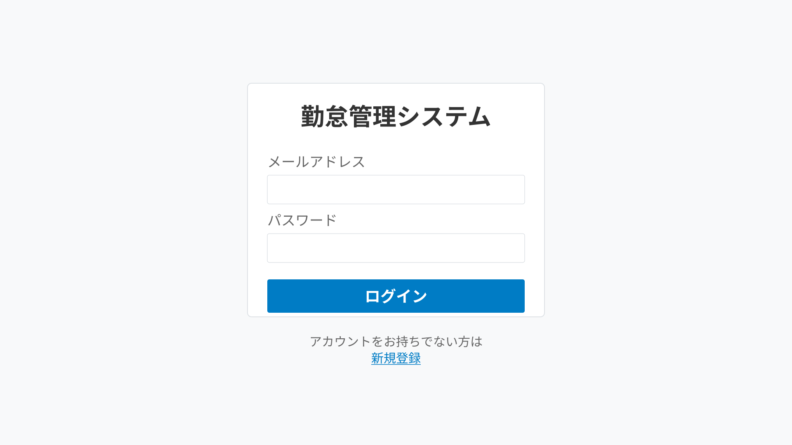

# ログイン機能 変更仕様書

## 変更概要

登録済みユーザーがメールアドレスとパスワードを使用してシステムにログインする機能を実装します。

## 画面仕様

### UI構成



### 画面要素

#### タイトル
- **表示**: 「勤怠管理システム」
- **フォント**: Arial, sans-serif
- **サイズ**: 58px
- **フォントウェイト**: bold
- **配置**: 中央揃え

#### 入力フィールド

1. **メールアドレス**
   - ラベル: 「メールアドレス」
   - 入力タイプ: email
   - 必須: はい
   - 形式: 有効なメールアドレス形式
   - 大文字小文字: 区別しない

2. **パスワード**
   - ラベル: 「パスワード」
   - 入力タイプ: password
   - 必須: はい
   - 形式: 半角英数字・記号
   - 大文字小文字: 区別する

#### ボタン

1. **ログインボタン**
   - ラベル: 「ログイン」
   - 色: #007cc5
   - サイズ: 幅624px × 高さ81px
   - 動作: 入力内容を検証後、認証処理を実行

2. **新規登録リンク**
   - テキスト: 「アカウントをお持ちでない方は」「新規登録」
   - 色: #007cc5（リンク部分）
   - スタイル: 下線付き
   - 動作: 新規登録画面に遷移

## バリデーション仕様

### クライアント側バリデーション

1. **必須チェック**
   - メールアドレスとパスワードが入力されているか確認

2. **メールアドレス形式チェック**
   - 有効なメールアドレス形式であるか確認

### サーバー側バリデーション

1. **認証チェック**
   - メールアドレスとパスワードの組み合わせが正しいか確認
   - パスワードはハッシュ化されたものと比較

2. **アカウントステータスチェック**
   - アカウントが有効であるか確認
   - アカウントがロックされていないか確認

## エラーハンドリング

### エラーメッセージ一覧

| エラー条件 | メッセージ | 対処法 |
|-----------|----------|--------|
| 必須項目未入力 | 「メールアドレスとパスワードを入力してください」 | 両方の項目を入力 |
| メールアドレス形式不正 | 「有効なメールアドレスを入力してください」 | 正しい形式で入力 |
| 認証失敗 | 「メールアドレスまたはパスワードが正しくありません」 | 正しい認証情報を入力 |
| アカウントロック | 「アカウントが一時的にロックされています。15分後に再試行してください」 | 15分待機 |
| サーバーエラー | 「ログイン処理中にエラーが発生しました。しばらく経ってから再度お試しください」 | 時間をおいて再試行 |

## 処理フロー

### 正常系

1. ユーザーがログイン画面にアクセス
2. メールアドレスとパスワードを入力
3. 「ログイン」ボタンをクリック
4. クライアント側バリデーション実行
5. サーバーに認証リクエスト送信
6. サーバー側で認証処理
7. JWTトークン生成
8. トークンをクライアントに返却
9. トークンをローカルストレージに保存
10. メインダッシュボードに遷移

### 異常系

1. バリデーションエラー発生時
   - エラーメッセージを該当フィールドの下に表示

2. 認証エラー発生時
   - エラーメッセージをフォームの上部に表示
   - ログイン失敗回数をカウント
   - 5回連続失敗でアカウントを15分間ロック

3. アカウントロック時
   - ロックメッセージを表示
   - ログインボタンを無効化

## セキュリティ仕様

### セッション管理

1. **JWTトークン**
   - アルゴリズム: HS256
   - 有効期限: 24時間
   - ペイロード:
     - userId: ユーザーID
     - email: メールアドレス
     - iat: 発行時刻
     - exp: 有効期限

2. **リフレッシュトークン**
   - 有効期限: 7日間
   - HTTPOnly Cookie に保存

### 認証失敗対策

1. **レート制限**
   - 同一IPアドレスから1分間に5回まで
   - 同一メールアドレスで5回連続失敗したら15分間ロック

2. **パスワード試行ログ**
   - すべてのログイン試行をログに記録
   - 失敗時もIPアドレスとタイムスタンプを記録

### セキュリティヘッダー

- X-Content-Type-Options: nosniff
- X-Frame-Options: DENY
- X-XSS-Protection: 1; mode=block
- Strict-Transport-Security: max-age=31536000

## API仕様

### エンドポイント
- **URL**: POST /api/auth/login
- **Content-Type**: application/json

### リクエストボディ

```json
{
  "email": "yamada.taro@example.com",
  "password": "SecurePassword123"
}
```

### レスポンス

#### 成功時 (200 OK)

```json
{
  "success": true,
  "message": "ログインに成功しました",
  "data": {
    "user": {
      "id": "uuid-1234-5678",
      "name": "山田 太郎",
      "email": "yamada.taro@example.com"
    },
    "token": "eyJhbGciOiJIUzI1NiIsInR5cCI6IkpXVCJ9...",
    "expiresIn": 86400
  }
}
```

#### エラー時 (401 Unauthorized)

```json
{
  "success": false,
  "message": "メールアドレスまたはパスワードが正しくありません",
  "remainingAttempts": 3
}
```

#### アカウントロック時 (429 Too Many Requests)

```json
{
  "success": false,
  "message": "アカウントが一時的にロックされています",
  "lockUntil": "2025-12-21T06:37:39.954Z"
}
```

## 自動ログアウト仕様

### 無操作タイムアウト

- **時間**: 30分間操作がない場合
- **動作**: 
  - セッションを無効化
  - ローカルストレージからトークンを削除
  - ログイン画面にリダイレクト
  - 「セッションがタイムアウトしました」メッセージを表示

### トークン期限切れ

- **時間**: 24時間後
- **動作**:
  - リフレッシュトークンがあれば自動更新
  - リフレッシュトークンもない場合はログイン画面にリダイレクト

## テスト仕様

### 単体テスト

- [ ] バリデーション関数の動作確認
- [ ] トークン生成・検証の確認
- [ ] パスワードハッシュ比較の確認

### 統合テスト

- [ ] 正常系: 正しい認証情報でログイン成功
- [ ] 異常系: 間違ったメールアドレスでログイン失敗
- [ ] 異常系: 間違ったパスワードでログイン失敗
- [ ] 異常系: 5回連続失敗でアカウントロック
- [ ] 異常系: レート制限の確認

### E2Eテスト

- [ ] ログイン画面にアクセスできる
- [ ] メールアドレスとパスワードを入力できる
- [ ] ログインボタンをクリックして認証できる
- [ ] 成功時にダッシュボードに遷移する
- [ ] エラー時に適切なメッセージが表示される
- [ ] 新規登録リンクが機能する
- [ ] 30分無操作で自動ログアウトする

### セキュリティテスト

- [ ] SQLインジェクション攻撃への耐性確認
- [ ] XSS攻撃への耐性確認
- [ ] CSRF攻撃への耐性確認
- [ ] ブルートフォース攻撃への耐性確認

## 関連仕様

- [ユーザー登録機能](001-add-user-registration.md)
- [ログアウト機能](003-add-logout.md)
- [パスワードリセット機能](password-reset.md)
- [認証・認可仕様](authentication.md)

## 変更履歴

| 日付 | バージョン | 変更内容 | 担当者 |
|-----|----------|---------|-------|
| 2025-12-21 | 1.0.0 | 初版作成 | - |
