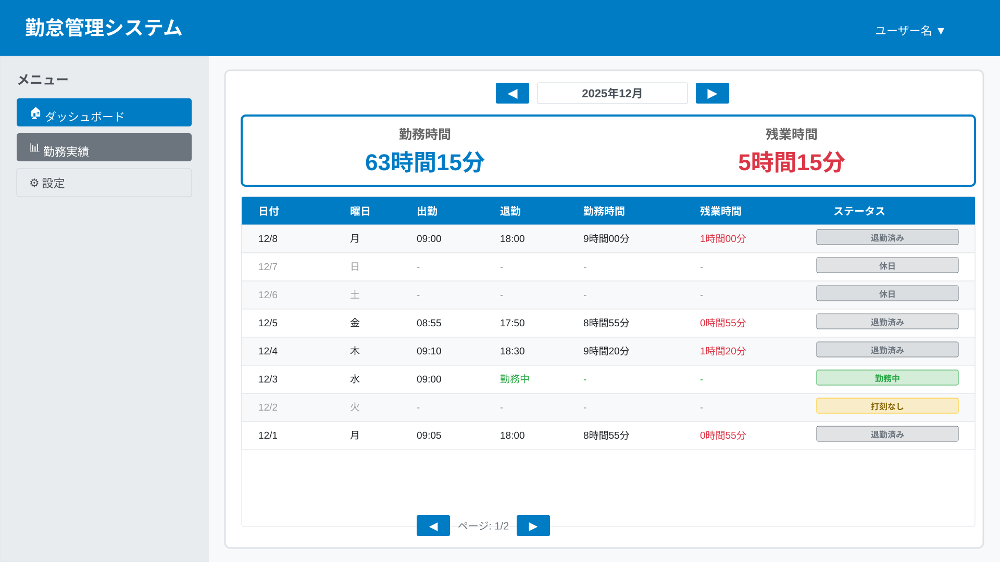
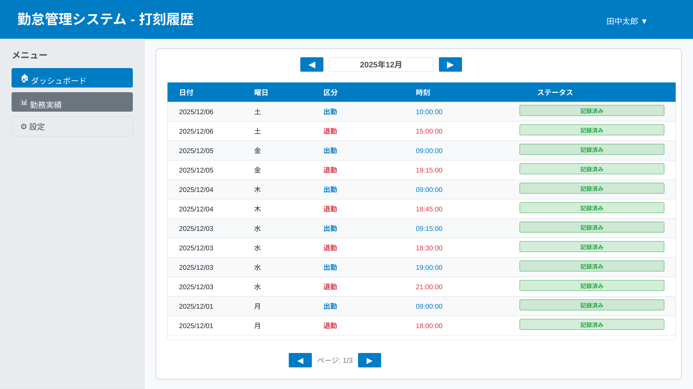

# 勤怠履歴機能 変更仕様書

## 変更概要

従業員が自分の過去の勤怠記録を確認できる機能を実装します。月単位で表示し、出勤・退勤時刻や勤務時間を一覧できます。

## 画面仕様

### 月次履歴表示UI構成



### 日次履歴表示UI構成


### 打刻履歴表示UI構成



### 画面要素

#### ヘッダー部

1. **ページタイトル**
   - 表示: 「勤怠履歴」
   - フォント: Arial, sans-serif
   - サイズ: 32px
   - フォントウェイト: bold

2. **月選択コントロール**
   - 前月ボタン: ◀
   - 現在表示月: YYYY年MM月
   - 次月ボタン: ▶
   - 配置: 中央揃え

#### 勤怠記録一覧テーブル

1. **テーブルヘッダー**
   - 日付
   - 出勤時刻
   - 退勤時刻
   - 勤務時間
   - ステータス

2. **データ行**
   - 各列にソート機能を実装
   - 日付は降順（新しい順）がデフォルト
   - 未入力日も表示（グレーアウト）

3. **ページネーション**
   - 1ページあたり30件表示
   - ページ番号表示
   - 前後ページへの移動ボタン

#### フッター部

1. **月次サマリー**
   - 表示: 「合計勤務時間（MM月）: ◯◯時間◯◯分」
   - 配置: テーブル下部
   - スタイル: 太字

## 機能仕様

### 表示項目

| 項目 | 説明 | 形式 |
|-----|------|------|
| 日付 | 勤務日 | YYYY/MM/DD |
| 出勤時刻 | 出勤を打刻した時刻 | HH:MM:SS |
| 退勤時刻 | 退勤を打刻した時刻 | HH:MM:SS |
| 勤務時間 | 自動計算された勤務時間 | ◯時間◯◯分 |
| ステータス | 勤務状況 | 勤務中 / 退勤済み / 打刻なし |

### ステータス定義

1. **勤務中**
   - 条件: 出勤打刻済み、退勤打刻未実施
   - 表示色: オレンジ（#ffc107）
   - アイコン: 時計マーク

2. **退勤済み**
   - 条件: 出勤・退勤の両方が打刻済み
   - 表示色: 緑（#28a745）
   - アイコン: チェックマーク

3. **打刻なし**
   - 条件: その日に打刻記録がない
   - 表示色: グレー（#6c757d）
   - 表示: 時刻は「-」で表示

### 月選択機能

1. **前月ボタン**
   - 動作: 表示月を1ヶ月前に変更
   - 制限: 入社日以前は選択不可

2. **次月ボタン**
   - 動作: 表示月を1ヶ月後に変更
   - 制限: 現在月より先は選択不可

3. **初期表示月**
   - デフォルト: 現在月

### ソート機能

1. **ソート可能列**
   - 日付（デフォルト: 降順）
   - 出勤時刻
   - 退勤時刻
   - 勤務時間

2. **ソート動作**
   - 列ヘッダーをクリックで昇順/降順切り替え
   - ソート方向を矢印アイコンで表示

### ページネーション

1. **表示件数**
   - 1ページ: 30件
   - カスタマイズ不可

2. **ページ移動**
   - 前ページボタン
   - ページ番号直接指定
   - 次ページボタン

### 月次サマリー

1. **合計勤務時間**
   - 計算: 表示月のすべての勤務時間を合計
   - 形式: ◯◯時間◯◯分
   - 更新: 月選択時に再計算

## 処理フロー

### 初期表示

1. ユーザーが「勤怠履歴」メニューをクリック
2. 現在月の勤怠記録を取得
3. テーブル形式で表示
4. 月次サマリーを計算して表示

### 月選択

1. ユーザーが前月/次月ボタンをクリック
2. 選択月の勤怠記録を取得
3. テーブルを更新
4. 月次サマリーを再計算

### ソート

1. ユーザーが列ヘッダーをクリック
2. クライアント側でソート実行
3. テーブルを更新

### ページ移動

1. ユーザーがページ番号またはボタンをクリック
2. 該当ページのデータを表示

## バリデーション仕様

### アクセス権限

1. **本人のみ閲覧可能**
   - ログイン中のユーザーの記録のみ表示
   - 他人の記録は閲覧不可

2. **認証チェック**
   - ログイン必須
   - トークン検証

## エラーハンドリング

### エラーメッセージ一覧

| エラー条件 | メッセージ | 対処法 |
|-----------|----------|--------|
| データ取得失敗 | 「勤怠記録の取得に失敗しました。再度お試しください」 | ページ再読み込み |
| 認証エラー | 「認証に失敗しました。再度ログインしてください」 | ログイン画面に遷移 |
| サーバーエラー | 「サーバーエラーが発生しました。しばらく経ってから再度お試しください」 | 時間をおいて再試行 |
| データなし | 「表示する勤怠記録がありません」 | メッセージ表示 |

## API仕様

### 月次勤怠記録取得エンドポイント

- **URL**: GET /api/attendance/history
- **Authorization**: Bearer {token}
- **Query Parameters**:
  - year: 年（YYYY）
  - month: 月（MM）
  - page: ページ番号（デフォルト: 1）
  - perPage: 1ページあたりの件数（デフォルト: 30）

#### リクエスト例

```
GET /api/attendance/history?year=2025&month=12&page=1&perPage=30
```

#### レスポンス（成功時: 200 OK）

```json
{
  "success": true,
  "data": {
    "year": 2025,
    "month": 12,
    "records": [
      {
        "attendanceId": "uuid-1234-5678",
        "date": "2025-12-21",
        "clockInTime": "2025-12-21T09:00:00.000Z",
        "clockOutTime": "2025-12-21T18:00:00.000Z",
        "workingHours": 9.0,
        "status": "completed"
      },
      {
        "attendanceId": "uuid-1234-5679",
        "date": "2025-12-20",
        "clockInTime": "2025-12-20T09:15:00.000Z",
        "clockOutTime": null,
        "workingHours": null,
        "status": "working"
      },
      {
        "attendanceId": null,
        "date": "2025-12-19",
        "clockInTime": null,
        "clockOutTime": null,
        "workingHours": null,
        "status": "absent"
      }
    ],
    "pagination": {
      "currentPage": 1,
      "totalPages": 1,
      "totalRecords": 21,
      "perPage": 30
    },
    "summary": {
      "totalWorkingHours": 168.5,
      "totalWorkingDays": 20
    }
  }
}
```

### 日次詳細取得エンドポイント（オプション）

- **URL**: GET /api/attendance/detail/:date
- **Authorization**: Bearer {token}
- **Parameters**:
  - date: 日付（YYYY-MM-DD）

#### レスポンス（成功時: 200 OK）

```json
{
  "success": true,
  "data": {
    "attendanceId": "uuid-1234-5678",
    "date": "2025-12-21",
    "clockInTime": "2025-12-21T09:00:00.000Z",
    "clockOutTime": "2025-12-21T18:00:00.000Z",
    "workingHours": 9.0,
    "status": "completed",
    "breaks": [
      {
        "breakId": "uuid-break-1",
        "startTime": "2025-12-21T12:00:00.000Z",
        "endTime": "2025-12-21T13:00:00.000Z",
        "duration": 1.0
      }
    ]
  }
}
```

## パフォーマンス要件

1. **初期表示**
   - 1秒以内にデータ取得完了
   - 2秒以内に画面表示完了

2. **月選択**
   - 0.5秒以内にデータ取得完了
   - 1秒以内に画面更新完了

3. **キャッシュ**
   - 取得済みの月データはキャッシュ
   - キャッシュ有効期限: 5分

## アクセシビリティ要件

1. **キーボード操作**
   - タブキーで要素間移動
   - Enterキーでボタン押下

2. **スクリーンリーダー対応**
   - テーブルヘッダーに適切なaria-label
   - ステータスに適切なaria-label

3. **色覚異常対応**
   - ステータスは色だけでなくアイコンでも識別可能

## テスト仕様

### 単体テスト

- [ ] 勤務時間合計計算ロジックの確認
- [ ] ステータス判定ロジックの確認
- [ ] ソート機能の確認
- [ ] ページネーション計算の確認

### 統合テスト

- [ ] 正常系: 勤怠記録取得成功
- [ ] 正常系: 月選択による記録更新
- [ ] 正常系: 月次サマリー計算
- [ ] 異常系: データなし時の表示
- [ ] 異常系: 認証エラー
- [ ] 異常系: サーバーエラー

### E2Eテスト

- [ ] 勤怠履歴画面にアクセスできる
- [ ] 現在月の記録が表示される
- [ ] 前月/次月ボタンで月を変更できる
- [ ] テーブルをソートできる
- [ ] ページネーションが機能する
- [ ] 月次サマリーが正しく表示される
- [ ] 未入力日が適切に表示される
- [ ] エラー時に適切なメッセージが表示される

### パフォーマンステスト

- [ ] 1年分（365件）のデータを1秒以内に表示
- [ ] ソート処理が0.5秒以内に完了
- [ ] ページ移動が0.3秒以内に完了

## 関連仕様

- [出勤・退勤打刻機能](004-add-clock-in-out.md)
- [メインダッシュボード](main-dashboard.md)
- [勤怠データエクスポート機能](attendance-export.md)

## 変更履歴

| 日付 | バージョン | 変更内容 | 担当者 |
|-----|----------|---------|-------|
| 2025-12-21 | 1.0.0 | 初版作成 | - |
