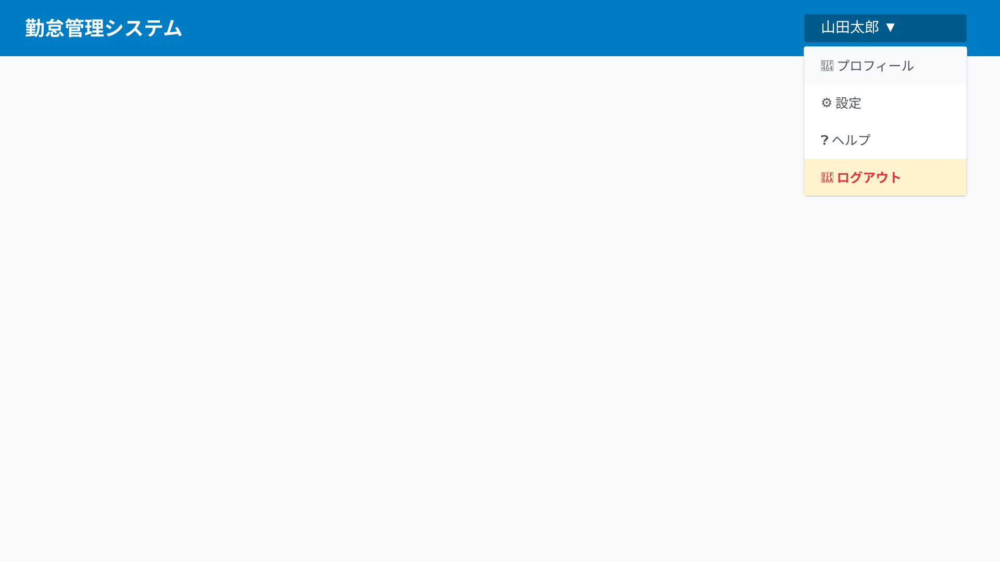

# ログアウト機能 変更仕様書

## 変更概要

ログイン中のユーザーがシステムからログアウトして、セッションを終了する機能を実装します。

## 画面仕様

### UI構成



### 画面要素

#### ログアウトメニュー

1. **ユーザー名表示**
   - 表示位置: 画面右上
   - 表示内容: ログイン中のユーザー名
   - スタイル: クリック可能（ドロップダウントリガー）

2. **ドロップダウンメニュー**
   - 表示タイミング: ユーザー名クリック時
   - メニュー項目:
     - 「ログアウト」

3. **ログアウト項目**
   - ラベル: 「ログアウト」
   - アイコン: ログアウトアイコン（オプション）
   - 動作: クリックでログアウト処理を実行

## 処理フロー

### 正常系

1. ユーザーが画面右上のユーザー名をクリック
2. ドロップダウンメニューが表示される
3. 「ログアウト」を選択
4. 確認ダイアログ表示（オプション）
5. サーバーにログアウトリクエスト送信
6. サーバー側でセッション無効化
7. クライアント側でトークン削除
8. ログイン画面にリダイレクト
9. 「ログアウトしました」メッセージ表示

### 異常系

1. サーバーエラー発生時
   - エラーメッセージを表示
   - クライアント側のトークンは削除
   - ログイン画面にリダイレクト

2. ネットワークエラー発生時
   - クライアント側のトークンは削除
   - ログイン画面にリダイレクト
   - 「オフラインでログアウトしました」メッセージ表示

## セキュリティ仕様

### セッション無効化

1. **サーバー側処理**
   - JWTトークンをブラックリストに追加
   - リフレッシュトークンを削除
   - セッション情報をクリア

2. **クライアント側処理**
   - ローカルストレージからトークンを削除
   - セッションストレージをクリア
   - Cookieを削除

### セキュリティヘッダー

- Cache-Control: no-store
- Pragma: no-cache

## API仕様

### エンドポイント
- **URL**: POST /api/auth/logout
- **Content-Type**: application/json
- **Authorization**: Bearer {token}

### リクエストボディ

```json
{}
```

### レスポンス

#### 成功時 (200 OK)

```json
{
  "success": true,
  "message": "ログアウトしました"
}
```

#### エラー時 (500 Internal Server Error)

```json
{
  "success": false,
  "message": "ログアウト処理中にエラーが発生しました"
}
```

## 自動ログアウト仕様

### 無操作タイムアウト

- **時間**: 30分間操作がない場合
- **動作**:
  - 自動的にログアウト処理を実行
  - 「セッションがタイムアウトしました」メッセージを表示
  - ログイン画面にリダイレクト

### トークン期限切れ

- **時間**: 24時間後
- **動作**:
  - リフレッシュトークンがあれば自動更新を試行
  - 更新失敗時は自動ログアウト
  - 「セッションの有効期限が切れました」メッセージを表示

## ユーザビリティ仕様

### 確認ダイアログ（オプション）

- **表示条件**: 未保存のデータがある場合
- **メッセージ**: 「未保存のデータがあります。ログアウトしてもよろしいですか？」
- **ボタン**:
  - 「ログアウト」: ログアウト処理を続行
  - 「キャンセル」: ログアウトをキャンセル

### ログアウト後の動作

1. **リダイレクト**
   - ログイン画面に遷移
   - URLパラメータで「logout=success」を付与

2. **メッセージ表示**
   - 「ログアウトしました」を3秒間表示

## 共有PC対策

### 推奨事項

1. **作業終了時の必須操作**
   - システム終了時は必ずログアウト
   - ブラウザを閉じる前にログアウト

2. **セキュリティメッセージ**
   - 共有PCを使用している場合の注意喚起
   - 初回ログイン時に表示

## テスト仕様

### 単体テスト

- [ ] トークンブラックリスト追加の確認
- [ ] セッション削除の確認
- [ ] クライアント側トークン削除の確認

### 統合テスト

- [ ] 正常系: ログアウト成功
- [ ] 正常系: ログアウト後のログイン画面遷移
- [ ] 正常系: ログアウト後のトークン無効化確認
- [ ] 異常系: サーバーエラー時の処理
- [ ] 異常系: ネットワークエラー時の処理

### E2Eテスト

- [ ] ユーザー名をクリックしてメニューが表示される
- [ ] ログアウト項目をクリックできる
- [ ] ログアウト後にログイン画面に遷移する
- [ ] ログアウト後に保護されたページにアクセスできない
- [ ] 自動ログアウト（30分無操作）が機能する
- [ ] ブラウザバックでログイン状態に戻れない

### セキュリティテスト

- [ ] ログアウト後にトークンが無効になる
- [ ] ログアウト後にAPIにアクセスできない
- [ ] セッションハイジャック攻撃への耐性確認
- [ ] CSRF攻撃への耐性確認

## エラーハンドリング

### エラーメッセージ一覧

| エラー条件 | メッセージ | 対処法 |
|-----------|----------|--------|
| サーバーエラー | 「ログアウト処理中にエラーが発生しましたが、ローカルセッションはクリアされました」 | ログイン画面にリダイレクト |
| ネットワークエラー | 「オフラインでログアウトしました。次回接続時に自動的に同期されます」 | ログイン画面にリダイレクト |
| 既にログアウト済み | 「既にログアウトしています」 | ログイン画面にリダイレクト |

## 関連仕様

- [ログイン機能](02-add-login.md)
- [認証・認可仕様](authentication.md)
- [セッション管理仕様](session-management.md)

## 変更履歴

| 日付 | バージョン | 変更内容 | 担当者 |
|-----|----------|---------|-------|
| 2025-12-21 | 1.0.0 | 初版作成 | - |
