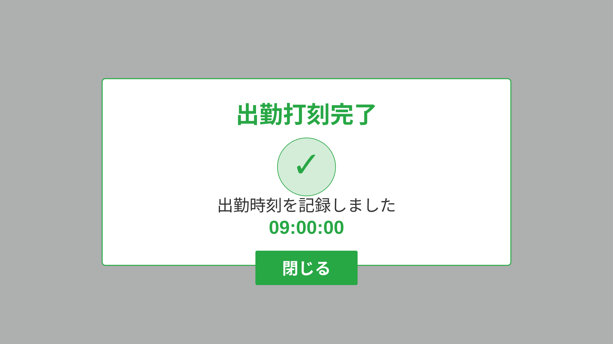
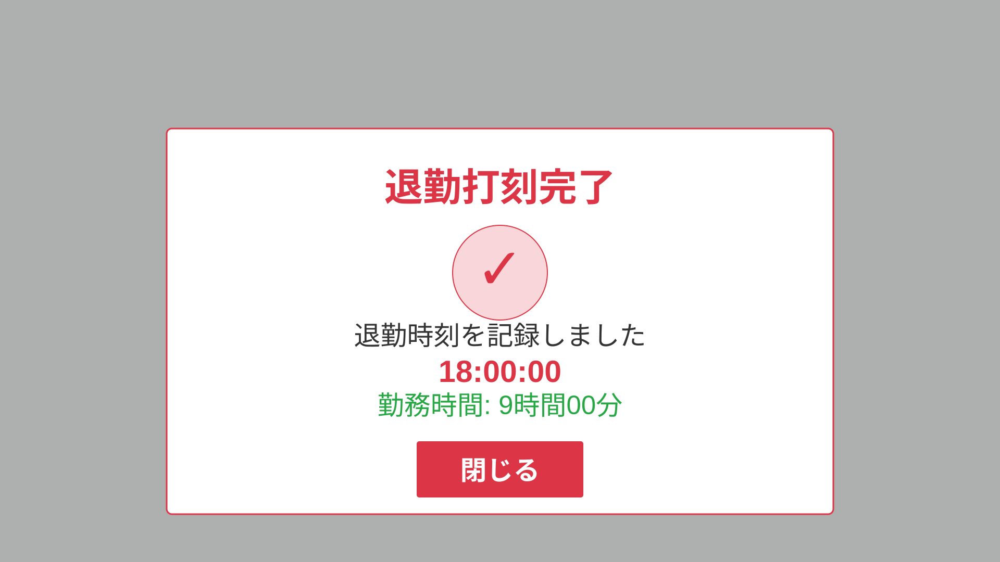

# 出勤・退勤打刻機能 変更仕様書

## 変更概要

従業員が出勤時と退勤時に時刻を記録するための打刻機能を実装します。

## 画面仕様

### 出勤打刻UI構成



### 退勤打刻UI構成



### 画面要素

#### メインダッシュボード


1. **現在時刻表示**
   - 表示形式: YYYY/MM/DD HH:MM:SS
   - 更新頻度: 1秒ごと
   - 配置: 画面中央上部

2. **出勤ボタン**
   - ラベル: 「出勤」
   - 色: #28a745（緑）
   - サイズ: 幅200px × 高さ80px
   - 状態:
     - 有効: 出勤打刻前
     - 無効: 出勤打刻済み（グレーアウト）

3. **退勤ボタン**
   - ラベル: 「退勤」
   - 色: #dc3545（赤）
   - サイズ: 幅200px × 高さ80px
   - 状態:
     - 無効: 出勤打刻前（グレーアウト）
     - 有効: 出勤打刻済み、退勤打刻前

4. **本日の勤務情報表示**
   - 出勤時刻: HH:MM:SS形式
   - 退勤時刻: HH:MM:SS形式
   - 勤務時間: ◯時間◯◯分形式（自動計算）

#### 確認ダイアログ

1. **出勤打刻確認**
   - タイトル: 「出勤打刻」
   - メッセージ: 「以下の時刻で出勤を記録します」
   - 打刻時刻表示: YYYY/MM/DD HH:MM:SS
   - ボタン:
     - 「確定」: 打刻を実行
     - 「キャンセル」: 打刻をキャンセル

2. **退勤打刻確認**
   - タイトル: 「退勤打刻」
   - メッセージ: 「以下の時刻で退勤を記録します」
   - 表示情報:
     - 出勤時刻: HH:MM:SS
     - 退勤時刻: HH:MM:SS
     - 勤務時間: ◯時間◯◯分
   - ボタン:
     - 「確定」: 打刻を実行
     - 「キャンセル」: 打刻をキャンセル

## 機能仕様

### 出勤打刻

#### 制約事項

1. **1日1回のみ**
   - 1日（0:00〜23:59）に1回のみ打刻可能
   - 打刻済みの場合は出勤ボタンを無効化

2. **打刻時刻**
   - サーバー時刻を使用
   - クライアント時刻は参考表示のみ

3. **修正不可**
   - ユーザー自身では修正不可
   - 修正が必要な場合は管理者に依頼

#### 処理フロー

1. ユーザーがメインダッシュボードにアクセス
2. 出勤ボタンが有効状態で表示
3. 「出勤」ボタンをクリック
4. 確認ダイアログ表示
5. 打刻時刻を確認
6. 「確定」ボタンをクリック
7. サーバーに打刻リクエスト送信
8. データベースに出勤時刻を記録
9. 成功メッセージ表示
10. 画面を更新（出勤ボタン無効化、退勤ボタン有効化）

### 退勤打刻

#### 制約事項

1. **出勤後のみ可能**
   - 出勤打刻をした後のみ退勤打刻可能
   - 出勤打刻前は退勤ボタンを無効化

2. **1日1回のみ**
   - 1日（0:00〜23:59）に1回のみ打刻可能
   - 打刻済みの場合は退勤ボタンを無効化

3. **打刻時刻**
   - サーバー時刻を使用
   - 出勤時刻より後である必要がある

4. **修正不可**
   - ユーザー自身では修正不可
   - 修正が必要な場合は管理者に依頼

#### 処理フロー

1. ユーザーがメインダッシュボードにアクセス
2. 出勤打刻済みで退勤ボタンが有効状態で表示
3. 「退勤」ボタンをクリック
4. 確認ダイアログ表示
5. 出勤時刻、退勤時刻、勤務時間を確認
6. 「確定」ボタンをクリック
7. サーバーに打刻リクエスト送信
8. データベースに退勤時刻を記録
9. 成功メッセージ表示
10. 画面を更新（退勤ボタン無効化）

### 勤務時間計算

1. **計算式**
   - 勤務時間 = 退勤時刻 - 出勤時刻

2. **表示形式**
   - ◯時間◯◯分
   - 例: 8時間30分

3. **丸め処理**
   - 秒単位は切り捨て
   - 分単位で表示

## バリデーション仕様

### クライアント側バリデーション

1. **打刻状態チェック**
   - 出勤打刻済みか確認
   - 退勤打刻済みか確認

### サーバー側バリデーション

1. **重複チェック**
   - 同日に既に打刻済みでないか確認

2. **時系列チェック**
   - 退勤時刻が出勤時刻より後であるか確認

3. **認証チェック**
   - ログイン中のユーザーか確認
   - トークンが有効か確認

## エラーハンドリング

### エラーメッセージ一覧

| エラー条件 | メッセージ | 対処法 |
|-----------|----------|--------|
| 出勤打刻重複 | 「本日は既に出勤打刻済みです」 | ページを再読み込み |
| 退勤打刻重複 | 「本日は既に退勤打刻済みです」 | ページを再読み込み |
| 出勤前退勤 | 「出勤打刻が行われていません」 | 先に出勤打刻を実行 |
| 時刻不整合 | 「打刻時刻に不整合があります。管理者に連絡してください」 | 管理者に連絡 |
| サーバーエラー | 「打刻処理中にエラーが発生しました。しばらく経ってから再度お試しください」 | 時間をおいて再試行 |

## API仕様

### 出勤打刻エンドポイント

- **URL**: POST /api/attendance/clock-in
- **Content-Type**: application/json
- **Authorization**: Bearer {token}

#### リクエストボディ

```json
{
  "timestamp": "2025-12-21T09:00:00.000Z"
}
```

#### レスポンス（成功時: 201 Created）

```json
{
  "success": true,
  "message": "出勤を記録しました",
  "data": {
    "attendanceId": "uuid-1234-5678",
    "userId": "uuid-user-1234",
    "clockInTime": "2025-12-21T09:00:00.000Z",
    "date": "2025-12-21"
  }
}
```

### 退勤打刻エンドポイント

- **URL**: POST /api/attendance/clock-out
- **Content-Type**: application/json
- **Authorization**: Bearer {token}

#### リクエストボディ

```json
{
  "attendanceId": "uuid-1234-5678",
  "timestamp": "2025-12-21T18:00:00.000Z"
}
```

#### レスポンス（成功時: 200 OK）

```json
{
  "success": true,
  "message": "退勤を記録しました",
  "data": {
    "attendanceId": "uuid-1234-5678",
    "userId": "uuid-user-1234",
    "clockInTime": "2025-12-21T09:00:00.000Z",
    "clockOutTime": "2025-12-21T18:00:00.000Z",
    "workingHours": 9.0,
    "date": "2025-12-21"
  }
}
```

### 本日の打刻状態取得エンドポイント

- **URL**: GET /api/attendance/today
- **Authorization**: Bearer {token}

#### レスポンス（成功時: 200 OK）

```json
{
  "success": true,
  "data": {
    "attendanceId": "uuid-1234-5678",
    "date": "2025-12-21",
    "clockInTime": "2025-12-21T09:00:00.000Z",
    "clockOutTime": null,
    "status": "working"
  }
}
```

## セキュリティ仕様

1. **認証必須**
   - すべてのエンドポイントで認証が必要

2. **本人確認**
   - トークンから取得したユーザーIDで打刻
   - 他人の打刻は不可

3. **タイムスタンプ検証**
   - サーバー時刻との差が10秒以内であることを確認
   - リプレイ攻撃を防止

4. **CSRF対策**
   - CSRFトークンを使用

## テスト仕様

### 単体テスト

- [ ] 勤務時間計算ロジックの確認
- [ ] 打刻状態判定ロジックの確認
- [ ] バリデーション関数の確認

### 統合テスト

- [ ] 正常系: 出勤打刻成功
- [ ] 正常系: 退勤打刻成功
- [ ] 異常系: 重複打刻エラー
- [ ] 異常系: 出勤前退勤エラー
- [ ] 異常系: 認証エラー

### E2Eテスト

- [ ] メインダッシュボードにアクセスできる
- [ ] 出勤ボタンをクリックして打刻できる
- [ ] 確認ダイアログが表示される
- [ ] 出勤打刻後、退勤ボタンが有効になる
- [ ] 退勤ボタンをクリックして打刻できる
- [ ] 勤務時間が正しく計算される
- [ ] エラー時に適切なメッセージが表示される

## 関連仕様

- [勤怠履歴機能](05-add-attendance-history.md)
- [メインダッシュボード](main-dashboard.md)
- [認証・認可仕様](authentication.md)

## 変更履歴

| 日付 | バージョン | 変更内容 | 担当者 |
|-----|----------|---------|-------|
| 2025-12-21 | 1.0.0 | 初版作成 | - |
