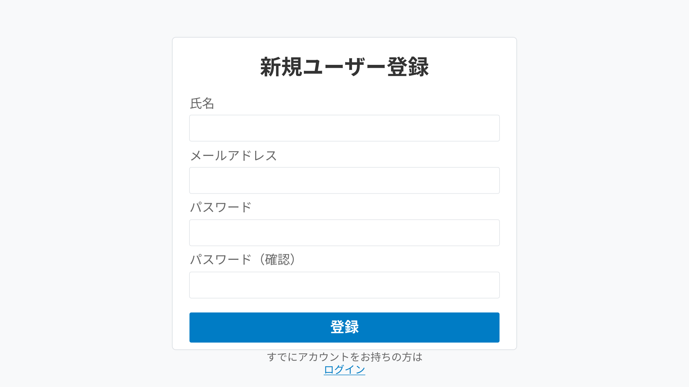

# ユーザー登録機能 変更仕様書

## 変更概要

新規ユーザーがシステムを利用開始するためのアカウント登録機能を実装します。

## ユーザー向け情報

### Why（なぜこの機能が必要か）

勤怠管理システムを利用するには、まず個人のアカウントを作成する必要があります。アカウントを持つことで：
- 自分専用の勤怠記録を保存できます
- セキュアな環境で個人情報を管理できます
- 他のユーザーと区別して勤怠データを記録できます

### What（何が追加されるか）

**新規ユーザー登録画面**が追加されます。

この画面では以下の情報を入力してアカウントを作成できます：
- 氏名
- メールアドレス（ログインIDとして使用）
- パスワード
- 会社コード（管理者から提供）

### How（どのように使うか）

1. ログイン画面の「新規登録」リンクをクリック
2. 登録フォームに必要事項を入力
3. 「登録」ボタンをクリック
4. 登録完了後、確認メールが届きます
5. メール内のリンクをクリックしてメールアドレスを確認
6. ログイン画面からログインできるようになります

詳細な使い方は[ユーザーマニュアル](../../../docs/user/MANUAL.md)を参照してください。

## 技術仕様

### 関連ドキュメント

本機能の実装に関連する技術ドキュメント：

#### フロントエンド
- [フロントエンド設計](../../../docs/implement/FRONTEND.md) - Reactコンポーネント設計
  - ユーザー登録フォームコンポーネントの実装
  - バリデーションロジックの実装
  - 状態管理（Zustand）

#### バックエンド
- [バックエンド設計](../../../docs/implement/BACKEND.md) - NestJSサービス設計
  - ユーザー登録APIエンドポイント
  - パスワードハッシュ化処理
  - メール送信サービス

#### API
- [API設計](../../../docs/implement/API.md) - RESTful API仕様
  - `POST /api/auth/register` エンドポイント

#### データベース
- [データベース設計](../../../docs/implement/DATABASE.md) - スキーマ設計
  - usersテーブルの定義
  - メールアドレスの一意性制約

#### セキュリティ
- [セキュリティ](../../../docs/implement/SECURITY.md) - セキュリティ対策
  - パスワードのハッシュ化（bcrypt）
  - CSRF対策
  - レート制限

#### テスト
- [単体テスト](../../../docs/test/UNIT.md)
- [統合テスト](../../../docs/test/INTEGRATION.md)
- [E2Eテスト](../../../docs/test/E2E.md)
- [セキュリティテスト](../../../docs/test/SECURITY_STATIC.md)

### 画面仕様



#### 入力フィールド

1. **氏名**
   - 入力タイプ: テキスト
   - 必須: はい
   - 最大文字数: 50文字
   - 使用可能文字: 全角・半角英数字、漢字、ひらがな、カタカナ、スペース

2. **メールアドレス**
   - 入力タイプ: email
   - 必須: はい
   - 形式: RFC 5322準拠
   - 一意性: システム内で一意

3. **パスワード**
   - 入力タイプ: password
   - 必須: はい
   - 最小文字数: 8文字
   - 複雑さ要件: 英大文字、英小文字、数字を各1文字以上含む

4. **パスワード（確認）**
   - 入力タイプ: password
   - 必須: はい
   - 検証: パスワードフィールドと一致

### API仕様

#### エンドポイント
- **URL**: `POST /api/auth/register`
- **Content-Type**: `application/json`

#### リクエストボディ

```json
{
  "name": "山田 太郎",
  "email": "yamada.taro@example.com",
  "password": "SecurePassword123",
  "passwordConfirm": "SecurePassword123"
}
```

#### レスポンス

**成功時 (201 Created)**
```json
{
  "success": true,
  "message": "登録が完了しました。確認メールを送信しました。",
  "data": {
    "userId": "uuid-1234-5678",
    "email": "yamada.taro@example.com"
  }
}
```

**エラー時 (400 Bad Request)**
```json
{
  "success": false,
  "message": "入力内容にエラーがあります",
  "errors": [
    {
      "field": "email",
      "message": "このメールアドレスは既に登録されています"
    }
  ]
}
```

### バリデーション

#### クライアント側
- 必須項目チェック
- メールアドレス形式チェック
- パスワード強度チェック（8文字以上、英大文字・小文字・数字を含む）
- パスワード一致チェック

#### サーバー側
- メールアドレス重複チェック
- パスワード脆弱性チェック

### セキュリティ要件

- パスワードはbcryptでハッシュ化（ソルトラウンド数: 10以上）
- CSRFトークンを使用
- レート制限: 同一IPから1時間あたり5回まで
- XSS対策: すべての入力をサニタイズ

### テスト要件

- [ ] 単体テスト: バリデーション関数、パスワードハッシュ化
- [ ] 統合テスト: API正常系・異常系
- [ ] E2Eテスト: ユーザー登録フロー
- [ ] セキュリティテスト: SQLインジェクション、XSS耐性

## 変更履歴

| 日付 | バージョン | 変更内容 | 担当者 |
|-----|----------|---------|-------|
| 2025-12-21 | 1.0.0 | 初版作成 | - |
|-----------|----------|--------|
| 必須項目未入力 | 「{項目名}を入力してください」 | 該当項目を入力 |
| メールアドレス形式不正 | 「有効なメールアドレスを入力してください」 | 正しい形式で入力 |
| メールアドレス重複 | 「このメールアドレスは既に登録されています」 | 別のメールアドレスを使用 |
| パスワード強度不足 | 「パスワードは8文字以上で、英大文字・英小文字・数字を含む必要があります」 | 要件を満たすパスワードを入力 |
| パスワード不一致 | 「パスワードが一致しません」 | 同じパスワードを入力 |
| サーバーエラー | 「登録処理中にエラーが発生しました。しばらく経ってから再度お試しください」 | 時間をおいて再試行 |

## 処理フロー

### 正常系

1. ユーザーが「新規登録」リンクをクリック
2. 登録画面が表示される
3. ユーザーが各項目を入力
4. 「登録」ボタンをクリック
5. クライアント側バリデーション実行
6. サーバーにリクエスト送信
7. サーバー側バリデーション実行
8. データベースにユーザー情報を登録
9. 確認メール送信
10. 登録完了画面に遷移

### 異常系

1. バリデーションエラー発生時
   - エラーメッセージを該当フィールドの下に表示
   - フォーカスを最初のエラーフィールドに移動

2. サーバーエラー発生時
   - エラーメッセージをモーダルまたはトースト通知で表示
   - ユーザー入力値を保持

## API仕様

### エンドポイント
- **URL**: POST /api/auth/register
- **Content-Type**: application/json

### リクエストボディ

```json
{
  "name": "山田 太郎",
  "email": "yamada.taro@example.com",
  "password": "SecurePassword123",
  "passwordConfirm": "SecurePassword123"
}
```

### レスポンス

#### 成功時 (201 Created)

```json
{
  "success": true,
  "message": "登録が完了しました。確認メールを送信しました。",
  "data": {
    "userId": "uuid-1234-5678",
    "email": "yamada.taro@example.com"
  }
}
```

#### エラー時 (400 Bad Request)

```json
{
  "success": false,
  "message": "入力内容にエラーがあります",
  "errors": [
    {
      "field": "email",
      "message": "このメールアドレスは既に登録されています"
    }
  ]
}
```

## セキュリティ要件

1. **パスワード保護**
   - パスワードはbcryptでハッシュ化して保存
   - ソルトラウンド数: 10以上

2. **CSRF対策**
   - CSRFトークンを使用

3. **レート制限**
   - 同一IPアドレスからの連続登録を制限
   - 1時間あたり5回まで

4. **入力サニタイゼーション**
   - XSS攻撃を防ぐため、すべての入力をサニタイズ

## テスト仕様

### 単体テスト

- [ ] 各バリデーション関数の動作確認
- [ ] パスワードハッシュ化の確認
- [ ] メールアドレス重複チェックの確認

### 統合テスト

- [ ] 正常系: 全項目正しく入力した場合の登録成功
- [ ] 異常系: 各バリデーションエラーの確認
- [ ] 異常系: メールアドレス重複時のエラー

### E2Eテスト

- [ ] ユーザーが登録画面にアクセスできる
- [ ] すべての入力フィールドが表示される
- [ ] 各フィールドに入力できる
- [ ] 登録ボタンをクリックして登録できる
- [ ] エラー時に適切なメッセージが表示される
- [ ] ログインリンクが機能する

## 関連仕様

- [ログイン機能](002-add-login.md)
- [メール送信機能](email-notification.md)
- [認証・認可仕様](authentication.md)

## 変更履歴

| 日付 | バージョン | 変更内容 | 担当者 |
|-----|----------|---------|-------|
| 2025-12-21 | 1.0.0 | 初版作成 | - |
