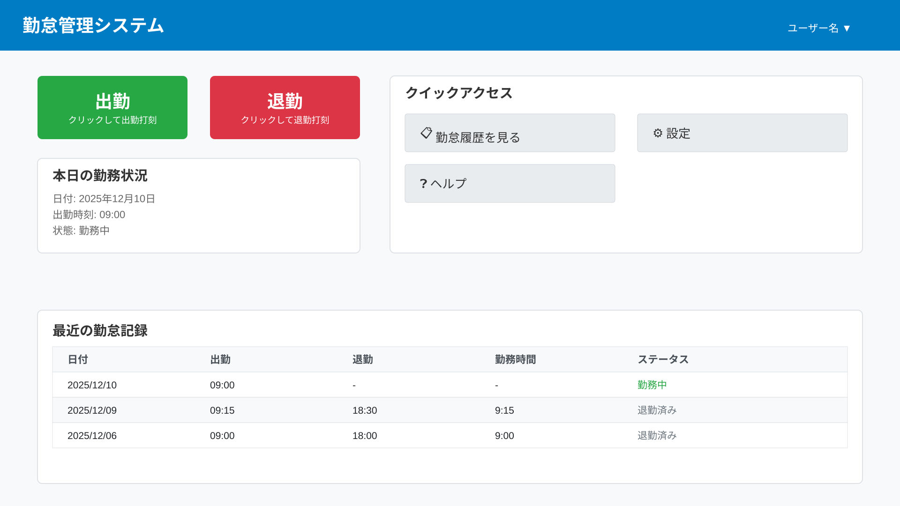

# 出勤・退勤打刻機能 変更仕様書

## 変更概要

従業員が出勤時と退勤時に時刻を記録するための打刻機能を実装します。

## ユーザー向け情報

### Why（なぜこの機能が必要か）

勤怠を正確に記録するために必要です。打刻することで：
- 正確な出勤・退勤時刻が記録されます
- 勤務時間が自動計算されます
- 後から勤怠履歴を確認できます

### What（何が追加されるか）

**出勤・退勤打刻ボタン**がメインダッシュボードに追加されます。

この機能では：
- ワンクリックで出勤時刻を記録できます
- ワンクリックで退勤時刻を記録できます
- 勤務時間が自動的に計算されます

### How（どのように使うか）

**出勤時**
1. メインダッシュボードの「出勤」ボタンをクリック
2. 確認ダイアログで時刻を確認
3. 「確定」をクリック

**退勤時**
1. メインダッシュボードの「退勤」ボタンをクリック
2. 確認ダイアログで出勤時刻・退勤時刻・勤務時間を確認
3. 「確定」をクリック

詳細な使い方は[ユーザーマニュアル](../../../docs/user/MANUAL.md)を参照してください。

## 技術仕様

### 関連ドキュメント

本機能の実装に関連する技術ドキュメント：

#### フロントエンド
- [フロントエンド設計](../../../docs/implement/FRONTEND.md)
  - 打刻ボタンコンポーネント、確認ダイアログ

#### バックエンド
- [バックエンド設計](../../../docs/implement/BACKEND.md)
  - 打刻サービス、時刻記録

#### API
- [API設計](../../../docs/implement/API.md)
  - `POST /api/attendance/clock-in`
  - `POST /api/attendance/clock-out`

#### データベース
- [データベース設計](../../../docs/implement/DATABASE.md)
  - attendanceテーブル

#### テスト
- [E2Eテスト](../../../docs/test/E2E.md)

### 画面仕様




### API仕様

#### 出勤打刻
- **URL**: `POST /api/attendance/clock-in`

**リクエストボディ**
```json
{
  "timestamp": "2025-12-21T09:00:00.000Z"
}
```

**レスポンス (201 Created)**
```json
{
  "success": true,
  "message": "出勤を記録しました",
  "data": {
    "attendanceId": "uuid-1234-5678",
    "clockInTime": "2025-12-21T09:00:00.000Z"
  }
}
```

#### 退勤打刻
- **URL**: `POST /api/attendance/clock-out`

**リクエストボディ**
```json
{
  "attendanceId": "uuid-1234-5678",
  "timestamp": "2025-12-21T18:00:00.000Z"
}
```

**レスポンス (200 OK)**
```json
{
  "success": true,
  "message": "退勤を記録しました",
  "data": {
    "attendanceId": "uuid-1234-5678",
    "clockOutTime": "2025-12-21T18:00:00.000Z",
    "workingHours": 9.0
  }
}
```

### 制約事項

- 1日（0:00〜23:59）に出勤・退勤各1回のみ
- サーバー時刻を使用（クライアント時刻は参考表示のみ）
- ユーザー自身では修正不可（管理者に依頼）

### セキュリティ

- 認証必須（JWT）
- 本人確認（他人の打刻不可）
- タイムスタンプ検証（リプレイ攻撃防止）

### テスト要件

- [ ] E2Eテスト: 出勤打刻フロー、退勤打刻フロー

## 変更履歴

| 日付 | バージョン | 変更内容 | 担当者 |
|-----|----------|---------|-------|
| 2025-12-21 | 1.0.0 | 初版作成 | - |
