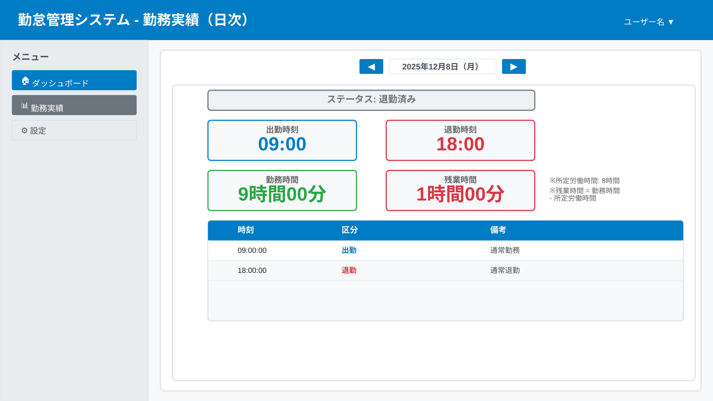

# 勤怠履歴機能 変更仕様書

## 変更概要

従業員が自分の過去の勤怠記録を確認できる機能を実装します。月単位で表示し、出勤・退勤時刻や勤務時間を一覧できます。

## ユーザー向け情報

### Why（なぜこの機能が必要か）

過去の勤怠を確認するために必要です。履歴を見ることで：
- 自分の働いた記録を確認できます
- 月の合計勤務時間が分かります
- 打刻漏れがないか確認できます

### What（何が追加されるか）

**勤怠履歴画面**が追加されます。

この画面では：
- 月単位で勤怠記録を一覧表示できます
- 日付、出勤時刻、退勤時刻、勤務時間が確認できます
- 月次の合計勤務時間が表示されます

### How（どのように使うか）

1. 左側のメニューから「勤怠履歴」をクリック
2. 現在月の勤怠記録が表示されます
3. 前月・次月ボタンで表示月を変更できます
4. 各日の出勤・退勤時刻と勤務時間を確認できます

詳細な使い方は[ユーザーマニュアル](../../../docs/user/MANUAL.md)を参照してください。

## 技術仕様

### 関連ドキュメント

本機能の実装に関連する技術ドキュメント：

#### フロントエンド
- [フロントエンド設計](../../../docs/implement/FRONTEND.md)
  - 履歴テーブルコンポーネント、月選択

#### バックエンド
- [バックエンド設計](../../../docs/implement/BACKEND.md)
  - 履歴取得サービス、集計処理

#### API
- [API設計](../../../docs/implement/API.md)
  - `GET /api/attendance/history`

#### データベース
- [データベース設計](../../../docs/implement/DATABASE.md)
  - attendanceテーブルクエリ

#### テスト
- [E2Eテスト](../../../docs/test/E2E.md)
- [パフォーマンステスト](../../../docs/test/PERFORMANCE.md)

### 画面仕様





### API仕様

#### エンドポイント
- **URL**: `GET /api/attendance/history`
- **Query Parameters**:
  - `year`: 年（YYYY）
  - `month`: 月（MM）
  - `page`: ページ番号（デフォルト: 1）
  - `perPage`: 1ページあたりの件数（デフォルト: 30）

**リクエスト例**
```
GET /api/attendance/history?year=2025&month=12&page=1&perPage=30
```

**レスポンス (200 OK)**
```json
{
  "success": true,
  "data": {
    "year": 2025,
    "month": 12,
    "records": [
      {
        "date": "2025-12-21",
        "clockInTime": "2025-12-21T09:00:00.000Z",
        "clockOutTime": "2025-12-21T18:00:00.000Z",
        "workingHours": 9.0,
        "status": "completed"
      }
    ],
    "summary": {
      "totalWorkingHours": 168.5,
      "totalWorkingDays": 20
    }
  }
}
```

### 表示項目

| 項目 | 説明 | 形式 |
|-----|------|------|
| 日付 | 勤務日 | YYYY/MM/DD |
| 出勤時刻 | 出勤を打刻した時刻 | HH:MM:SS |
| 退勤時刻 | 退勤を打刻した時刻 | HH:MM:SS |
| 勤務時間 | 自動計算された勤務時間 | ◯時間◯◯分 |
| ステータス | 勤務状況 | 勤務中 / 退勤済み / 打刻なし |

### セキュリティ

- 認証必須（JWT）
- 本人のデータのみ閲覧可能

### パフォーマンス

- 初期表示: 1秒以内
- 月選択: 0.5秒以内
- キャッシュ: 5分間有効

### テスト要件

- [ ] E2Eテスト: 履歴表示、月選択
- [ ] パフォーマンステスト: 1年分（365件）を1秒以内に表示

## 変更履歴

| 日付 | バージョン | 変更内容 | 担当者 |
|-----|----------|---------|-------|
| 2025-12-21 | 1.0.0 | 初版作成 | - |
